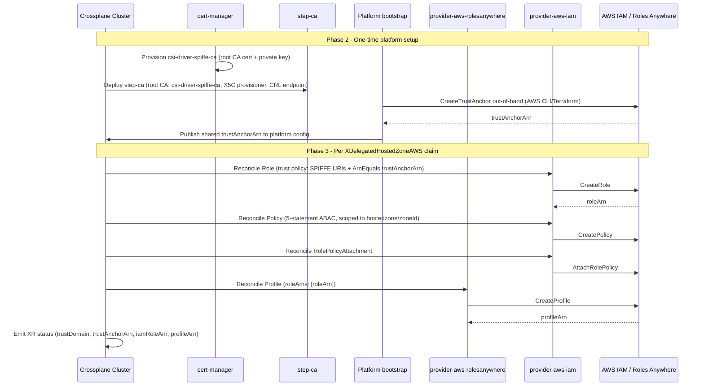
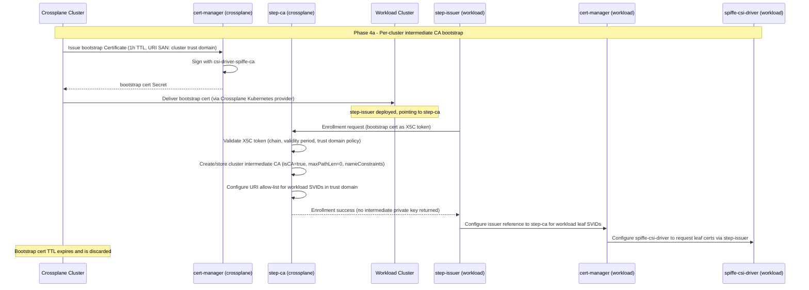
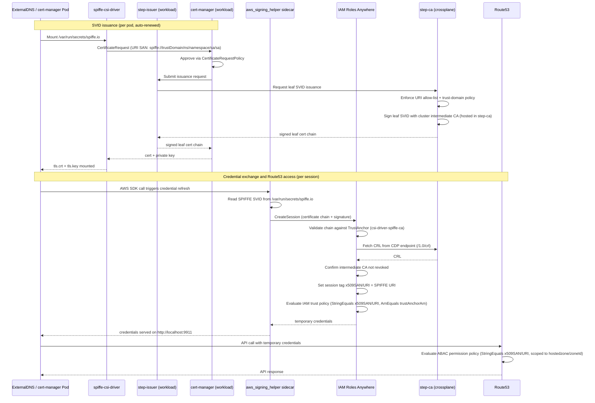

# 7. Crossplane Composition for ExternalDNS and CertManager IAM Roles Anywhere

Date: 2026-05-28

## Status

Accepted

## Context

### Goal

AWS IAM Roles Anywhere is a service that allows workloads running outside
of AWS to securely access AWS resources using IAM roles. This is particularly
useful for applications that need to interact with AWS services but are
not hosted within the AWS environment.

ExternalDNS and CertManager are two popular Kubernetes add-ons that manage
DNS records and TLS certificates, respectively. Both of these add-ons
require access to AWS resources to function properly. By using Crossplane
Composition, we can create a reusable and modular infrastructure definition
that allows ExternalDNS and CertManager to securely access AWS resources
using IAM Roles Anywhere. This approach will enable us to manage the necessary
IAM roles and permissions in a consistent and scalable manner, while also
ensuring that our applications can securely interact with AWS services
regardless of where they are hosted.

We need to build a composition that provisions the necessary IAM permissions
and trust relationships for ExternalDNS and CertManager to securely access
AWS resources using IAM Roles Anywhere.  This will involve provisioning the
necessary trust anchors, profiles, IAM roles and policies that are
required for the IAM Roles Anywhere trust relationship to function properly
and grant the necessary permissions to ExternalDNS and CertManager.

The IAM Roles Anywhere identity resources (IAM Role, Policy, RolePolicyAttachment, and
Roles Anywhere Profile) are provisioned directly within the
[XDelegatedHostedZoneAWS](applications/crossplane-resources/delegated-hosted-zone-aws)
composition. Because every delegated zone instance always has a corresponding workload
identity, coupling them in a single composition eliminates cross-resource references,
guarantees lifecycle coupling (IAM resources are deleted when the zone claim is deleted),
and reduces the number of claims an operator must create from two to one. All IAM
values are derived from existing composition inputs — no additional IAM-specific inputs
are needed beyond an optional `spec.trustAnchorArn` override (otherwise defaulted
from platform configuration) and optional provider config overrides
(`spec.iamProviderConfigRef` and `spec.rolesAnywhereProviderConfigRef`, both
defaulted from platform configuration when omitted) for least-privilege
credential separation.

IAM permissions for ExternalDNS to access Route53 hosted zones are documented [here](https://raw.githubusercontent.com/kubernetes-sigs/external-dns/refs/heads/master/docs/tutorials/aws.md), and IAM permissions for CertManager to access Route53 hosted zones are documented [here](https://cert-manager.io/docs/configuration/acme/dns01/route53/).

The Composistion should consider Crossplane Resources where possible to provision the necessary AWS resources, which may include the following:
- [Role](https://marketplace.upbound.io/providers/upbound/provider-aws-iam/v2.5.4/resources/iam.aws.m.upbound.io/Role/v1beta1)
- [Policy](https://marketplace.upbound.io/providers/upbound/provider-aws-iam/v2.5.4/resources/iam.aws.m.upbound.io/Policy/v1beta1)
- [RolePolicyAttachment](https://marketplace.upbound.io/providers/upbound/provider-aws-iam/v2.5.4/resources/iam.aws.m.upbound.io/RolePolicyAttachment/v1beta1)
- [Profile](https://marketplace.upbound.io/providers/upbound/provider-aws-rolesanywhere/v2.5.4/resources/rolesanywhere.aws.m.upbound.io/Profile/v1beta1)

The aws terraform provider provides support for configuring trust anchor and profile resources
- [aws_iam_rolesanywhere_trust_anchor](https://registry.terraform.io/providers/hashicorp/aws/latest/docs/resources/iam_rolesanywhere_trust_anchor)
  - source:
      source_type: "CERTIFCATE_BUNDLE"
      source_data:
        x509_certificate_data: |
            -----BEGIN CERTIFICATE-----
            ...
            -----END CERTIFICATE-----
- [aws_iam_rolesanywhere_profile](https://registry.terraform.io/providers/hashicorp/aws/latest/docs/resources/rolesanywhere_profile)
- [aws_iam_role](https://registry.terraform.io/providers/hashicorp/aws/latest/docs/resources/iam_role)
- [aws_iam_policy](https://registry.terraform.io/providers/hashicorp/aws/latest/docs/resources/iam_policy)
- [aws_iam_role_policy_attachment](https://registry.terraform.io/providers/hashicorp/aws/latest/docs/resources/iam_role_policy_attachment)


Example terraform code for provisioning the necessary trust anchor and profile resources for IAM Roles Anywhere is shown below:

```hcl
resource "aws_rolesanywhere_trust_anchor" "test" {
  name = "example"
  source {
    source_type = "CERTIFICATE_BUNDLE"
    source_data {
      x509_certificate_data = <<EOF
      -----BEGIN CERTIFICATE-----
      ...
      -----END CERTIFICATE-----
      EOF
    }
    source_type = "AWS_ACM_PCA"
  }
}

resource "aws_iam_policy" "ExternalDNSRoute53Access" {
  name        = "AllowExternalDNSRoute53Access"
  path        = "/"
  description = "Allow ExternalDNS to manage DNS records in one delegated hosted zone"

  # Terraform's "jsonencode" function converts a
  # Terraform expression result to valid JSON syntax.
  policy = jsonencode({
    "Version": "2012-10-17",
    "Statement": [
      {
        "Effect": "Allow",
        "Action": [
          "route53:ChangeResourceRecordSets",
          "route53:ListResourceRecordSets",
          "route53:ListTagsForResources"
        ],
        "Resource": [
          "arn:aws:route53:::hostedzone/${var.delegated_hosted_zone_id}"
        ],
        "Condition": {
          "ForAllValues:StringLike": {
            "route53:ChangeResourceRecordSetsActions": ["CREATE", "UPSERT", "DELETE"],
            "route53:ChangeResourceRecordSetsRecordTypes": ["A", "AAAA", "CNAME", "TXT"]
          }
        }
      }
    ]
  })
}

resource "aws_iam_role" "ExternalDNS" {
  name = "ExternalDNS"
  path = "/"

  assume_role_policy = jsonencode({
    "Version": "2012-10-17",
    "Statement": [
        {
            "Effect": "Allow",
            "Principal": {
                "Service": "rolesanywhere.amazonaws.com"
            },
            "Action": [
                "sts:AssumeRole",
                "sts:SetSourceIdentity",
                "sts:TagSession"
            ],
            "Condition": {
                "StringEquals": {
                    "aws:PrincipalTag/x509SAN/URI": "spiffe://cluster.local/ns/external-dns/sa/external-dns"
                }
            }
        }
    ]
  })
}

resource "aws_iam_role_policy_attachment" "ExternalDNS-attach" {
  role       = aws_iam_role.ExternalDNS.name
  policy_arn = aws_iam_policy.ExternalDNSRoute53Access.arn
}

resource "aws_rolesanywhere_profile" "test" {
  name      = "example"
  role_arns = [aws_iam_role.ExternalDNS.arn]
}
```

An example of how terraform can be used to provision an AWS Roles anywhere trust anchor, profile and role is shown below:


Cert-manager and ExternalDNS will be modified to use the SPIFFE CSI driver to obtain SPIFFE X.509 SVID certificate.
A side-car will be deployed in cert-manager and ExternalDNS that implements the AWS IAM Roles Anywhere credential helper, which will allow cert-manager and ExternalDNS to securely access AWS resources using IAM Roles Anywhere by presenting the SPIFFE X.509 SVID certificate to the credential helper, which will then exchange the certificate for temporary AWS credentials that can be used to access AWS resources.

An example of the type of patch that will be applied to add SPIFFE CSI driver support and the AWS IAM Roles Anywhere credential helper to cert-manager and ExternalDNS is shown below:

```yaml
    spec:
      selector:
        matchLabels:
          app: upbound-provider-aws-route53
      template:
        metadata:
          labels:
            app: upbound-provider-aws-route53
        spec:
          securityContext:
            runAsGroup: 2000
            runAsNonRoot: true
            runAsUser: 2000
            fsGroup: 2000
          serviceAccountName: aws-route53-dns-provider
          containers:
            - name: package-runtime
              env:
                - name: AWS_REGION
                  value: us-east-2
                - name: AWS_EC2_METADATA_SERVICE_ENDPOINT
                  value: http://localhost:9911
            - name: aws-signing-helper
              image: public.ecr.aws/rolesanywhere/credential-helper:1.8.1-2026.04.09.16.01
              command: 
                - aws_signing_helper
                - serve
                - --port
                - "9911"
                - --debug
                - --certificate
                - /var/run/secrets/spiffe.io/tls.crt
                - --private-key
                - /var/run/secrets/spiffe.io/tls.key
                - --trust-anchor-arn
                - arn:aws:rolesanywhere:us-east-2:832767337984:trust-anchor/1433b5ab-1a7a-4134-9d84-baa79f94d093
                - --profile-arn
                - arn:aws:rolesanywhere:us-east-2:832767337984:profile/cbe4ff4a-87e4-4635-a08e-ace27111b830
                - --role-arn
                - arn:aws:iam::832767337984:role/crossplane-provider-dns-admin
              imagePullPolicy: IfNotPresent
              ports:
                - containerPort: 9911
                  name: imdsv2
                  protocol: TCP
              volumeMounts:
                - mountPath: "/var/run/secrets/spiffe.io"
                  name: spiffe
          volumes:
            - name: spiffe
              csi:
                driver: spiffe.csi.cert-manager.io
                readOnly: true
```

### Dependencies

The first component of this solution is provided by 
[cert-manager](../../applications/cert-manager/base/), which is a Kubernetes
add-on that automates the management and issuance of TLS certificates.
Cert-manager can be used to provision the trust anchor certificate that is
required for IAM Roles Anywhere to establish a trust relationship with the
workloads running in our Kubernetes clusters.

The second component of this solution is provided by the
[cert-manager-spiffe-issuer](../../applications/cert-manager-spiffe-issuer/base/) module, which is a cert-manager issuer that uses the SPIFFE CSI driver to issue SPIFFE X.509 SVID certificates to workloads running in the cluster.

The third component of this solution is provided by the[approver-policy](../../applications/cert-manager-approver-policy/base/) controller, which can be used to implement approval policies for `CertificateRequest` resources in the cluster.  

The fourth component of this solution is the [cert-manager-trust-manager](../../applications/cert-manager-trust-manager/base/) controller, which can be used to implement trust bundles for certificate authorities in the cluster.  This is important for managing the trust relationships between the workloads in the cluster.

The last component of this solution is the [cert-manager-spiffe-csi-driver](../../applications/cert-manager-spiffe-csi-driver/base) controller, which can be used to implement the SPIFFE CSI driver for cert-manager.  This allows workloads running in the cluster to obtain SPIFFE X.509 SVID certificates that are signed by the intermediate CA certificate provisioned by the `cert-manager-spiffe-issuer` module, which is necessary for the SPIFFE CSI driver to function properly and allow workloads to securely access AWS resources using IAM Roles Anywhere.

### Self-Signed ClusterIssuer

Every Kubernetes cluster in the fleet will have a trust root provisioned
using the [cert-manager-spiffe-issuer](../../applications/cert-manager-spiffe-issuer/base)
module.

A [ClusterIssuer](https://cert-manager.io/docs/reference/api-docs/#cert-manager.io/v1.ClusterIssuer)
resource named [selfsigned](../../applications/cert-manager/base/resources/selfsigned.clusterissuer.yaml)
is used to issue a self-signed certificate that serves as the trust anchor for the IAM Roles Anywhere trust relationship.

The `selfsigned` `ClusterIssuer` is a self-signed issuer, which means that it will generate a self-signed certificate
and private key when it is created.  The self-signed certificate will be used as the trust anchor for the IAM Roles
Anywhere trust relationship, and the private key will be used to sign intermediate certificates that are issued to
workloads running in the cluster.

### Cluster Root Trust Anchor Certificate

The `cert-manager-spiffe-issuer` module provisions a self-signed root
[Certificate](https://cert-manager.io/docs/reference/api-docs/#cert-manager.io/v1.Certificate) resource in the
[cert-manager](../../applications/cert-manager/base/resources/namespace.yaml) namespace named
[csi-driver-spiffe-ca](../../applications/cert-manager-spiffe-issuer/base/resources/csi-driver-spiffe-ca.certificate.yaml).  

Cert-manager will provision the corresponding private key and certificate in a `Secret` resource named `csi-driver-spiffe-ca` in the `cert-manager` namespace.  The trust anchor certificate is stored in the `.data.tls\.crt` field of the
`Secret` resource, which is base64-encoded.

This certificate will be used as the trust anchor for the IAM Roles Anywhere trust relationship.  The
following bash command can be used to retrieve the trust anchor certificate from the cluster:

```bash
kubectl -n cert-manager get secret csi-driver-spiffe-ca -o jsonpath='{.data.tls\.crt}' | base64 --decode
```

A Human readable version of the trust anchor certificate can be obtained by running the following command:

```bash
kubectl -n cert-manager get secret csi-driver-spiffe-ca -o jsonpath='{.data.tls\.crt}' | base64 --decode | openssl x509 -text -noout
```

### Intermediate Certificate Authority for Workloads in the Cluster

The `cert-manager-spiffe-issuer` module provisions a `ClusterIssuer` resource named
[csi-driver-spiffe-issuer](../../applications/cert-manager-spiffe-issuer/base/resources/csi-driver-spiffe-ca.clusterissuer.yaml)
that uses the Root Trust Anchor Certificate and Private Key in the `csi-driver-spiffe-ca` `Secret` resource
provisioned by the [csi-driver-spiffe-ca](../../applications/cert-manager-spiffe-issuer/base/resources/csi-driver-spiffe-ca.certificate.yaml) `Certificate` resource.

The `csi-driver-spiffe-issuer` `ClusterIssuer` resource acts as an intermediate certificate authority (CA) that is signed by the root trust anchor certificate.  The `ClusterIssuer` can then be used to issue certificates for workloads running in the cluster, and these certificates will be trusted by the IAM Roles Anywhere trust relationship because the Intermediate CA certificate is signed by the root trust anchor certificate.  

This allows workloads running in the cluster to securely access AWS resources using IAM Roles Anywhere without needing to manage their own trust anchor certificates.  The root trust anchor certificate serves as the foundation of the trust relationship between the workloads in the cluster and AWS.

Under the hood, the cert-manager SPIFFE CSI driver will use the
[CertificateRequest](https://cert-manager.io/docs/reference/api-docs/#cert-manager.io/v1.CertificateRequest) resource
to request certificates from the `csi-driver-spiffe-issuer` `ClusterIssuer` on behalf of workloads running in the cluster.
The `CertificateRequest` resource will specify the desired properties of the certificate, such as the URI SAN that is
required for the SPIFFE CSI driver to function properly.

By default, `CertificateRequest` resources require approval before they can be issued, which provides an additional layer of security and control over the issuance of certificates in the cluster.  The
[approver-policy](../../applications/cert-manager-approver-policy/base) controller can be used to implement approval policies
for `CertificateRequest` resources in the cluster, allowing us to define rules for when certificate requests should be
automatically approved or require manual approval.

A `CertificateRequestPolicy` resource named [csi-driver-spiffe-issuer-policy](../../applications/cert-manager-spiffe-issuer/base/resources/csi-driver-spiffe-ca.certificaterequestpolicy.yaml) is provisioned to allow the SPIFFE CSI driver to automatically approve `CertificateRequest` resources that are created by the SPIFFE CSI driver for workloads running in the cluster.  This ensures that workloads can obtain the necessary certificates to securely access AWS resources using IAM Roles Anywhere without requiring manual intervention for each certificate request.

### Giving cert-manager permissions to use the CertificateRequestPolicy

The `cert-manager-spiffe-issuer` module provisions a `Role` resource named
[cert-manager-spiffe-issuer-policy](../../applications/cert-manager-spiffe-issuer/base/resources/csi-driver-spiffe-ca.clusterrole.yaml) and a `RoleBinding` resource named
[cert-manager-spiffe-issuer-policy](../../applications/cert-manager-spiffe-issuer/base/resources/csi-driver-spiffe-ca.clusterrolebinding.yaml) to give the cert-manager controller permissions to use the `CertificateRequestPolicy` resource that is provisioned in the cluster.  This allows cert-manager to automatically approve `CertificateRequest` resources that are created by the SPIFFE CSI driver for workloads running in the cluster, which is necessary for the SPIFFE CSI driver to function properly and allow workloads to securely access AWS resources using IAM Roles Anywhere.


## Decision

We will implement IAM Roles Anywhere for ExternalDNS and CertManager using
Crossplane-managed AWS resources and SPIFFE identities issued by cert-manager.

The implementation will follow these decisions:

1. Least privilege by default
   - IAM policies for ExternalDNS and CertManager will be scoped to the
     delegated hosted zone ARN only, not all hosted zones in the account.
   - Route53 `ListHostedZones` will not be required for steady-state
     operation when the hosted zone identifier is known.

2. Per-workload permission scoping, enforced by SPIFFE URI
   - ExternalDNS and CertManager require different Route53 action scopes:
     cert-manager restricts `ChangeResourceRecordSets` to TXT records only
     (ACME DNS01 challenges), while ExternalDNS requires A, AAAA, CNAME,
     and TXT for full DNS lifecycle management.
   - The composition implements the ABAC single-role design (Option B): one
     IAM Role, one Policy, one RolePolicyAttachment, and one Roles Anywhere
     Profile per cluster. The policy contains five statements, each conditioned
     on `aws:PrincipalTag/x509SAN/URI`, enforcing per-workload action boundaries
     within a single role.
   - Neither workload session can access the other workload's permitted actions.
     The SPIFFE URI SAN is the authoritative identity boundary.
   - Option A (separate roles per workload) remains a valid escalation path for
     environments where role-assumption-time rejection of incorrect SPIFFE URIs
     is a hard requirement; it is not currently implemented in the composition.
     See "IAM policy design" in Limitations for a full comparison.

3. Crossplane is the source of truth for AWS identity resources
   - The `XDelegatedHostedZoneAWS` composition manages all AWS resources for
     a cluster's delegated DNS zone and workload identity as a single unit:
     Route53 hosted zone, Cloudflare NS delegation records, IAM Role, IAM
     Policy, RolePolicyAttachment, and Roles Anywhere Profile.
   - The IAM Role trust policy and permission policy are fully derived from
     composition inputs (`spec.subdomain`, the resolved parent zone name from
     `spec.zoneName` or platform configuration, and the resolved trust anchor
     ARN from `spec.trustAnchorArn` or platform configuration)
     — no separate composition or manual IAM authoring is required.
   - The composition outputs all IAM Roles Anywhere credential-helper inputs
     in status (`status.trustAnchorArn`, `status.iamRoleArn`, `status.profileArn`,
     `status.trustDomain`) so downstream automation can configure cert-manager
     and ExternalDNS without reading from multiple resources.
   - IAM resources (`Role`, `Policy`, `RolePolicyAttachment`) are managed via
     `provider-aws-iam` using `spec.iamProviderConfigRef` when set, otherwise
     the shared `platform-iam-rolesanywhere` environment default (`iam-admin`).
     Roles Anywhere resources (`Profile`) are managed via `provider-aws-rolesanywhere`
     using `spec.rolesAnywhereProviderConfigRef` when set, otherwise the shared
     `platform-iam-rolesanywhere` environment default (`rolesanywhere-admin`).
     The two provider configs reference distinct IAM roles with narrowly scoped
     permissions, consistent with the least-privilege principle in Decision 1.
   - The TrustAnchor itself is provisioned separately as a prerequisite (it
     depends on the workload cluster's CA certificate, which must exist before
     the claim is created). Because `provider-aws-rolesanywhere` currently
     exposes `Profile` but not `TrustAnchor`, the TrustAnchor is provisioned
     out-of-band (for example, AWS CLI or Terraform) and its ARN is published
     through platform configuration, with `spec.trustAnchorArn` available as an
     optional per-claim override.

4. Trust anchor provisioning is out-of-band with verification
   - We will provision the AWS IAM Roles Anywhere TrustAnchor out-of-band
     (for example, AWS CLI or Terraform) using the crossplane cluster root
     certificate (`csi-driver-spiffe-ca`) as the certificate bundle source.
   - The resulting TrustAnchor ARN will be published into platform
     configuration and consumed automatically by `XDelegatedHostedZoneAWS`
     claims unless a claim explicitly overrides it via `spec.trustAnchorArn`.
   - The bootstrap workflow must verify trust anchor correctness (certificate
     bundle, region/account, and CRL settings) before claims are reconciled.

5. Certificate lifetime strategy
   - We will evaluate a 5-year trust anchor certificate duration against
     security and operations trade-offs before changing defaults.
   - No duration change will be merged without a documented rotation and
     emergency rollover runbook.

6. SPIFFE trust domain uniqueness for shared trust anchor patterns
   - Clusters using Pattern B, C, or D must configure a cluster-unique SPIFFE
     trust domain. With a shared trust anchor, IAM Roles Anywhere only validates
     that a certificate chains to the trusted root; it does not record which
     cluster's intermediate CA signed it. If all clusters use the default
     `cluster.local` trust domain, their SPIFFE URIs are identical and IAM
     role trust policy conditions cannot distinguish between clusters.
   - The default trust domain `cluster.local` is prohibited for any cluster
     participating in a shared trust anchor design.
   - The trust domain is derived from `XDelegatedHostedZoneAWS` as the
     resolved SPIFFE URI prefix and surfaced in `status.trustDomain`. By
     default this is `${spec.subdomain}.${resolvedZoneName}`, where
     `resolvedZoneName` comes from `spec.zoneName` when set, otherwise from
     the shared `platform-cloudflare` `EnvironmentConfig`. The prefix can be
     overridden via platform configuration with `spiffeURIPrefix`. The IAM
     Roles Anywhere composition consumes this value via cross-resource
     reference — no additional trust domain input is required.
   - Example: `subdomain: crossplane`, resolved `zoneName: rye.ninja` → trust
     domain `crossplane.rye.ninja` (or an environment override) → SPIFFE URI
     `spiffe://crossplane.rye.ninja/ns/external-dns/sa/external-dns`.
   - DNS names are globally unique by property, satisfying the uniqueness
     requirement automatically without a separate cluster-identity field.
   - Pattern A is exempt: the per-cluster trust anchor provides cluster
     isolation independently of the trust domain value. Unique trust domains
     are still recommended for operational clarity.

## Limitations

The following AWS service quotas and limits constrain the long-term scaling
shape of this design. Values are defaults unless otherwise noted.

### IAM Roles Anywhere object and API limits (per account, per Region)

- Trust anchors: 50
- Profiles: 250
- Roles per profile: 250
- Certificates per trust anchor: 2 (not adjustable)
- CRLs per trust anchor: 2 (not adjustable)
- CreateSession rate: 10 TPS (adjustable)
- Control-plane API rate buckets (for trust anchor/profile/subject/tagging/CRL APIs): 1 TPS each combined bucket (adjustable)

### IAM limits that affect this implementation

- Roles per account: 1000 default, up to 10000
- Customer managed policies per account: 1500 default, up to 10000
- Managed policies attached per role: 10 default, up to 25
- Role trust policy length: 2048 characters default, up to 8192
- Managed policy document size: 6144 characters
- Aggregate inline policy size on a role: 10240 characters

### Practical scaling implications

- Trust anchors are typically the first hard object limit encountered in a strict per-cluster trust model.
- Profiles are typically the next limiting object when each workload identity receives a dedicated profile.
- Shared-role designs reduce object count but increase trust-policy complexity and blast radius.
- CreateSession throttling can become a runtime bottleneck during large synchronized restarts.

### Pattern A: Per-cluster trust anchor with per-workload role/profile

Summary:
- Each cluster has its own trust anchor.
- Each workload identity (ExternalDNS and CertManager) has a dedicated IAM Role, Policy, and Roles Anywhere Profile.

Pros:
- Strongest isolation boundary between clusters.
- Clear least-privilege and ownership boundaries.
- Straightforward incident containment and cluster-specific revocation.

Cons:
- Highest object growth rate.
- Trust anchors (50/account/Region) are the first scaling bottleneck.
- More reconciliation objects and operational overhead.

When to choose:
- High-assurance environments with strict tenant or cluster isolation requirements.
- Environments where independent emergency rollback per cluster is mandatory.

Quota shape:
- Roughly linear growth per cluster across trust anchors, profiles, roles, and policies.
- With two workload identities per cluster, trust anchors usually cap before IAM role/policy quotas.

### Pattern B: Shared trust anchor per environment with per-cluster role/profile

Summary:
- One trust anchor is shared by multiple clusters in an environment (for example, dev or prod).
- Each cluster/workload identity still gets dedicated IAM Role, Policy, and Profile.

Pros:
- Significantly reduces trust-anchor object pressure.
- Retains role-level least privilege for hosted-zone access.
- Better account-level scalability while preserving workload separation.

Cons:
- Shared trust root increases blast radius if anchor material is compromised.
- Rotation and rollover procedures become more coordination-heavy.
- Requires tighter controls on SPIFFE identity issuance and verification.
- **Requires cluster-unique SPIFFE trust domains.** All clusters sharing this
  trust anchor must be configured with distinct trust domains (not `cluster.local`)
  to prevent cross-cluster role assumption via identical SPIFFE URI conditions.
  See "Trust domain uniqueness requirement" in the IAM policy design section.

When to choose:
- Platform environments targeting moderate/high cluster counts in a single account/Region.
- Teams that can operate disciplined trust-anchor lifecycle management.

Quota shape:
- Trust anchors grow by environment, while profiles/roles/policies still grow by cluster/workload.
- Profile quotas may become the first object bottleneck after trust anchors are flattened.

### Pattern C: Single trust anchor (crossplane root CA) with per-cluster intermediate CA — centrally issued

Summary:
- The crossplane cluster hosts the root CA (`csi-driver-spiffe-ca`) as the single IAM Roles Anywhere trust anchor.
- When provisioning a workload cluster, Crossplane issues an intermediate CA `Certificate` resource against the root CA
  on the crossplane cluster.
- The resulting intermediate CA cert and private key Secret is distributed to the workload cluster via
  External Secrets Operator or a Crossplane managed Kubernetes Secret.
- On the workload cluster, `cert-manager-spiffe-issuer` uses the delivered intermediate CA instead of a self-signed root.
- SVIDs issued on the workload cluster chain as: root CA → intermediate CA → SVID.
- IAM Roles Anywhere validates the full chain against the single trust anchor (root CA).

Pros:
- Single trust anchor eliminates the trust-anchor quota bottleneck entirely.
- Profiles (250 limit) become the first constraint, supporting ~125 clusters before quota increase is needed.
- Cluster-level revocation is still possible by revoking the intermediate CA.
- Simpler to implement with Crossplane — no bootstrap channel required between clusters.

Cons:
- Intermediate CA private key is generated on the crossplane cluster and transmitted to the workload cluster.
- The private key exists in two places (crossplane cluster Secret and workload cluster Secret), increasing the attack surface.
- Compromise of the root CA private key on the crossplane cluster compromises all workload clusters simultaneously.
- Rotation and revocation procedures must account for all clusters sharing the root trust.
- CRL support is limited to 2 CRLs per trust anchor (not adjustable); OCSP must be evaluated for timely revocation.

Key risks:
- Centralized key generation and distribution is the primary security concern.
- A decommissioned cluster whose intermediate CA is not explicitly revoked retains a valid credential path until
  the intermediate CA expires.

When to choose:
- Platform environments prioritizing operational simplicity and scale over strict key hygiene.
- Teams that accept centralized key management and have strong Secret encryption and access controls in place.

### Pattern D: Single trust anchor (crossplane root CA) with per-cluster intermediate CA — CSR-based

Summary:
- The crossplane cluster hosts the root CA as the single IAM Roles Anywhere trust anchor, same as Pattern C.
- The workload cluster generates its own intermediate CA keypair locally and submits a
  `CertificateSigningRequest` to the crossplane cluster for signing.
- The crossplane cluster (or a dedicated controller) signs the CSR against the root CA and returns only the
  signed certificate — the private key never leaves the workload cluster.
- On the workload cluster, `cert-manager-spiffe-issuer` uses the locally generated keypair and the
  signed intermediate CA certificate.
- SVIDs chain as: root CA → intermediate CA → SVID, same as Pattern C.

Pros:
- Strongest key hygiene: the intermediate CA private key is generated and stays on the workload cluster.
- Compromise of the crossplane cluster does not expose workload cluster private keys.
- Single trust anchor retains all quota benefits of Pattern C.
- Cluster-level revocation is still possible by revoking the intermediate CA certificate.

Cons:
- Requires a bootstrap channel between the workload cluster and the crossplane cluster before cert-manager is
  fully operational — a chicken-and-egg bootstrapping problem.
- More complex to implement: needs a controller or workflow to accept CSRs from workload clusters, verify
  their identity, sign with the root CA, and return the certificate.
- The bootstrap identity used to authenticate the CSR request must itself be secured independently.
- Higher operational complexity for the signing workflow and its failure modes.

Key risks:
- The bootstrapping identity and channel are a new trust root that must be carefully secured.
- If the signing workflow is unavailable, new workload clusters cannot become operational.

When to choose:
- High-assurance environments where private key hygiene is a hard requirement.
- Teams willing to invest in a robust bootstrap and signing workflow.

#### Pattern D deep-dive: cert-manager alone vs. step-ca

**Can cert-manager implement Pattern D without additional tooling?**

No. cert-manager is an in-cluster operator. Its `CertificateRequest` and `Certificate` resources are cluster-scoped
and have no native mechanism for cross-cluster CSR submission or signing. To implement Pattern D with cert-manager
alone, a custom external issuer controller would need to be written to:
- accept CSRs from workload clusters over a secure channel
- authenticate the identity of the requesting cluster before signing
- return only the signed certificate to the workload cluster

In addition, cert-manager does not generate Certificate Revocation Lists (CRLs) and has no built-in OCSP
responder. Implementing CRL-based revocation of intermediate CAs would require entirely separate tooling. For
these reasons, cert-manager alone is not sufficient for Pattern D.

**step-ca as the signing authority**

[step-ca](https://github.com/smallstep/certificates) is a purpose-built certificate authority server with native
support for the cross-cluster signing flow Pattern D requires. Key capabilities relevant to this design:

- **X5C provisioner**: a client authenticates a CSR by presenting an existing X.509 certificate that chains to a
  root trusted by step-ca. Crossplane can issue a short-lived bootstrap certificate to a new workload cluster
  during provisioning; the cluster presents this certificate to step-ca to authenticate its CSR for the
  intermediate CA. The private key is generated on the workload cluster and the bootstrap certificate expires
  after use.
- **K8sSA provisioner**: a client authenticates using a Kubernetes ServiceAccount token. step-ca is configured
  with the public key of the workload cluster's K8s API server to validate the token. This removes the need for
  a separate bootstrap certificate, but the K8sSA token is effectively a bearer token and provides minimal
  constraint on the CSR subject — it requires careful policy configuration to prevent over-issuance.
- **Certificate templates**: step-ca uses Go templates to control the content of issued certificates. Templates
  can enforce `isCA: true`, `maxPathLen: 0`, desired URI SANs, and CRL distribution point (CDP) extensions on
  intermediate CA certificates.
- **Built-in CRL server**: step-ca hosts a CRL at the `/1.0/crl` endpoint. The CRL is updated on every
  revocation. CDPs are embedded in issued certificates via templates, pointing to this endpoint.
- **cert-manager integration**: the [step-issuer](https://github.com/smallstep/step-issuer) external issuer
  allows cert-manager to remain the in-cluster certificate lifecycle manager while step-ca acts as the signing
  authority. On the workload cluster, cert-manager requests the intermediate CA certificate from step-ca via
  step-issuer; the keypair is generated locally by cert-manager.

**Recommended bootstrap flow for Pattern D using step-ca X5C provisioner**

```
Cluster provisioning (Crossplane)
  1. Crossplane issues a short-lived (e.g. 1h) bootstrap certificate to the new
     workload cluster, signed by the root CA. This cert contains the cluster's
     unique identity as a URI SAN or CN.
  2. Crossplane stores the bootstrap cert and configures step-ca with an X5C
     provisioner that trusts the root CA.

Workload cluster bootstrap (cert-manager + step-issuer)
  3. cert-manager generates an intermediate CA keypair on the workload cluster.
     The private key never leaves the cluster.
  4. cert-manager submits a CertificateRequest to step-issuer, including the CSR
     and the bootstrap certificate as the X5C authentication token.
  5. step-ca validates:
       a. the X5C certificate chains to the trusted root CA
       b. the X5C certificate is within its validity period
       c. the CSR subject/SAN matches the expected cluster identity (via template
          policy)
  6. step-ca signs the intermediate CA certificate with the CDP embedded and
     returns only the signed certificate.
  7. cert-manager-spiffe-issuer uses the signed intermediate CA + local keypair
     to issue SVIDs to workloads.
  8. The bootstrap certificate expires and is discarded.
```

**CRL distribution and IAM Roles Anywhere revocation**

To revoke a workload cluster's intermediate CA:
1. Run `step ca revoke <serial>` on step-ca. The CRL at `/1.0/crl` is immediately updated.
2. IAM Roles Anywhere checks CRL distribution points embedded in the intermediate CA certificate during
   session validation if the trust anchor has CRL checking enabled.

Two mechanisms exist for CRL delivery to IAM Roles Anywhere:

- **CDP-based checking (preferred)**: the intermediate CA certificate contains a `crlDistributionPoints`
  extension pointing to step-ca's `/1.0/crl` HTTP endpoint. IAM Roles Anywhere fetches and caches this CRL
  when validating certificate chains. **Requirement**: step-ca's CRL endpoint must be reachable from AWS over
  HTTP. This typically means exposing step-ca's insecure address (CRL is served over HTTP by design, as CDPs
  must be unauthenticated) via a load balancer or ingress.
- **Imported CRL (fallback)**: IAM Roles Anywhere allows importing a CRL file directly to a trust anchor
  (limit: 2 CRLs per trust anchor, not adjustable). A controller can watch step-ca for revocation events,
  fetch the updated CRL, and re-import it to IAM Roles Anywhere via the `ImportCrl` / `UpdateCrl` API. This
  avoids exposing step-ca to the internet but introduces a sync delay between revocation and enforcement.

Key operational notes:
- CRL checking in IAM Roles Anywhere is opt-in per trust anchor and must be explicitly enabled.
- CDP-based checking requires HTTP (not HTTPS) access to the CRL endpoint per RFC 5280.
- The 2 CRL slots per trust anchor limit applies to imported CRLs only; CDP-based checking is unlimited.
- OCSP is not available in step-ca open source; it is a commercial-only feature. CDP-based CRL is the
  recommended open source revocation mechanism.

**Summary: cert-manager alone vs. step-ca for Pattern D**

| Capability | cert-manager alone | step-ca + step-issuer |
|---|---|---|
| Cross-cluster CSR signing | Not supported natively | Native (X5C, K8sSA provisioners) |
| Key stays on workload cluster | Yes (with custom controller) | Yes (by design) |
| CRL generation | Not supported | Built-in (`/1.0/crl`) |
| CDP embedding in certs | Not supported | Via certificate templates |
| OCSP | Not supported | Commercial only |
| cert-manager integration | Native (in-cluster only) | Via step-issuer external issuer |
| Bootstrap complexity | Very high (custom controller needed) | Medium (X5C provisioner) |

**Conclusion**: step-ca with the X5C provisioner and step-issuer is the recommended implementation for Pattern D.
cert-manager remains the in-cluster lifecycle manager for SVIDs; step-ca handles intermediate CA issuance and
CRL generation on the crossplane cluster.

#### Pattern D refinement: controlplane-hosted intermediate authorities

To reduce key distribution and simplify revocation operations, we refine the
Pattern D implementation profile so per-cluster intermediate CAs are hosted in
step-ca on the crossplane controlplane cluster.

Refined model:
- step-ca creates and stores one intermediate CA per workload cluster in the
  controlplane environment (intermediate private keys do not leave step-ca).
- Workload clusters do not store intermediate CA private keys.
- Workload clusters request workload leaf certificates (SVIDs) from step-ca via
  step-issuer using authenticated bootstrap identity.
- IAM Roles Anywhere continues to validate root -> intermediate -> SVID chains
  against the shared root trust anchor.

Required SPIFFE URI issuance controls for this profile:
- step-ca authority/provisioner policy must enforce URI SAN allow-lists for
  each cluster trust domain (no wildcard trust domains).
- Issued workload SVIDs must match only approved SPIFFE path patterns:
  - `spiffe://<trustDomain>/ns/external-dns/sa/external-dns`
  - `spiffe://<trustDomain>/ns/cert-manager/sa/cert-manager`
- Intermediate CA certificates must include URI name constraints that permit
  only the cluster's SPIFFE URI subtree (`spiffe://<trustDomain>/`).
- Requests outside the trust domain or outside approved namespace/serviceaccount
  paths must be denied by step-ca policy.

Migration note (from prior Pattern D wording):
- Previous wording described workload-cluster-generated intermediate CA keys and
  a CSR signing flow where only the intermediate certificate was returned.
- The refined profile now hosts intermediate CAs in step-ca on the controlplane;
  workload clusters request only leaf SVID issuance.
- Implementation changes required for migration:
  - Remove any workflow that exports or stores intermediate CA private keys on
    workload clusters.
  - Create one step-ca intermediate authority per cluster trust domain.
  - Enforce URI name constraints on each intermediate (`spiffe://<trustDomain>/`).
  - Enforce exact URI SAN allow-list policy for issued workload SVIDs.
  - Update validation tests to include negative SAN tests and proof that
    intermediate private keys are never present on workload clusters.

### IAM policy design: separate roles vs. ABAC single role

IAM Roles Anywhere sets the certificate's URI SAN as a session tag on the
temporary credentials it issues, exposed as `aws:PrincipalTag/x509SAN/URI`
during IAM policy condition evaluation. This allows a single policy document
to contain multiple statements each conditioned on a specific SPIFFE URI,
enforcing per-workload permission boundaries even when both workloads share
a single IAM role.

**Permission comparison between the two workloads:**

| Action | cert-manager | ExternalDNS | Resource scope |
|---|---|---|---|
| `route53:ChangeResourceRecordSets` | Yes — **TXT only** | Yes — A, AAAA, CNAME, TXT | `hostedzone/<id>` |
| `route53:ListResourceRecordSets` | Yes | Yes | `hostedzone/<id>` |
| `route53:GetChange` | Yes (change propagation polling) | No | `change/*` |
| `route53:ListHostedZonesByName` | Yes (zone discovery) | No | `*` |
| `route53:ListHostedZones` | No | Yes (zone discovery) | `*` |
| `route53:ListTagsForResources` | No | Yes (TXT ownership tracking) | `hostedzone/<id>` |

The record-type scope difference on `ChangeResourceRecordSets` is the key reason
a single unconditioned policy cannot cover both workloads without violating PoLP.
ABAC conditions resolve this within a single policy document.

#### Option A: Separate roles (high-isolation default)

Two IAM roles, two policies, two profiles per cluster. Each role's trust policy
restricts assumption to exactly one SPIFFE URI. A misconfigured SPIFFE CSI policy
that issues the wrong URI to a pod is rejected at role-assumption time.

#### Option B: ABAC single role (quota-efficient default)

One IAM role, one policy, one profile per cluster. The role trust policy lists
both SPIFFE URIs; IAM `StringEquals` with a list value evaluates as set membership
(matches if the tag equals any listed value). The single policy document contains
five statements, each conditioned on `aws:PrincipalTag/x509SAN/URI`.

The `sts:SetSourceIdentity` and `sts:TagSession` actions must remain in the
trust policy to allow IAM Roles Anywhere to stamp the session identity and tags;
ABAC conditions in the permission policy will not function without these.

**Shared role trust policy condition** (trust domain derived from `${spec.subdomain}.${spec.zoneName}`):

```json
"Condition": {
  "StringEquals": {
    "aws:PrincipalTag/x509SAN/URI": [
      "spiffe://${subdomain}.${zoneName}/ns/cert-manager/sa/cert-manager",
      "spiffe://${subdomain}.${zoneName}/ns/external-dns/sa/external-dns"
    ]
  },
  "ArnEquals": {
    "aws:SourceArn": "${spec.trustAnchorArn}"
  }
}
```

**Merged ABAC permission policy** (zone ARN and trust domain derived from composition inputs):

```json
{
  "Version": "2012-10-17",
  "Statement": [
    {
      "Sid": "ExternalDNSRecordManagement",
      "Effect": "Allow",
      "Action": [
        "route53:ChangeResourceRecordSets",
        "route53:ListResourceRecordSets",
        "route53:ListTagsForResources"
      ],
      "Resource": "arn:aws:route53:::hostedzone/${status.zoneId}",
      "Condition": {
        "StringEquals": {
          "aws:PrincipalTag/x509SAN/URI":
            "spiffe://${subdomain}.${zoneName}/ns/external-dns/sa/external-dns"
        },
        "ForAllValues:StringLike": {
          "route53:ChangeResourceRecordSetsRecordTypes": ["A", "AAAA", "CNAME", "TXT", "SRV"]
        }
      }
    },
    {
      "Sid": "ExternalDNSZoneDiscovery",
      "Effect": "Allow",
      "Action": "route53:ListHostedZones",
      "Resource": "*",
      "Condition": {
        "StringEquals": {
          "aws:PrincipalTag/x509SAN/URI":
            "spiffe://${subdomain}.${zoneName}/ns/external-dns/sa/external-dns"
        }
      }
    },
    {
      "Sid": "CertManagerACMEDNS01",
      "Effect": "Allow",
      "Action": [
        "route53:ChangeResourceRecordSets",
        "route53:ListResourceRecordSets"
      ],
      "Resource": "arn:aws:route53:::hostedzone/${status.zoneId}",
      "Condition": {
        "StringEquals": {
          "aws:PrincipalTag/x509SAN/URI":
            "spiffe://${subdomain}.${zoneName}/ns/cert-manager/sa/cert-manager",
          "route53:ChangeResourceRecordSetsRecordTypes": ["TXT"]
        }
      }
    },
    {
      "Sid": "CertManagerChangePolling",
      "Effect": "Allow",
      "Action": "route53:GetChange",
      "Resource": "arn:aws:route53:::change/*",
      "Condition": {
        "StringEquals": {
          "aws:PrincipalTag/x509SAN/URI":
            "spiffe://${subdomain}.${zoneName}/ns/cert-manager/sa/cert-manager"
        }
      }
    },
    {
      "Sid": "CertManagerZoneDiscovery",
      "Effect": "Allow",
      "Action": "route53:ListHostedZonesByName",
      "Resource": "*",
      "Condition": {
        "StringEquals": {
          "aws:PrincipalTag/x509SAN/URI":
            "spiffe://${subdomain}.${zoneName}/ns/cert-manager/sa/cert-manager"
        }
      }
    }
  ]
}
```

**Trade-offs:**

| | Option A: Separate roles | Option B: ABAC single role |
|---|---|---|
| Roles per cluster | 2 | 1 |
| Policies per cluster | 2 | 1 |
| Profiles per cluster | 2 | 1 |
| PoLP boundary | Role assumption (strongest) | Policy statement condition |
| Misconfigured SPIFFE URI | Rejected at role assumption | Rejected at API authorization |
| CloudTrail attribution | Role name distinguishes workload | Must inspect `x509SAN/URI` session tag |
| Object count saving | Baseline | 50% reduction in roles, policies, profiles |

#### Trust domain uniqueness requirement for shared trust anchors

This requirement applies to **both** Option A and Option B when used with
Patterns B, C, or D — any design where multiple clusters share a trust anchor.

**The problem**: The default SPIFFE trust domain is `cluster.local`. All
clusters using this default produce identical SPIFFE URIs, for example
`spiffe://cluster.local/ns/external-dns/sa/external-dns`. With a shared
trust anchor, IAM Roles Anywhere validates only that the certificate chains
to the trusted root CA — it does not identify which cluster's intermediate
CA signed it. The IAM role trust policy condition then evaluates
`aws:PrincipalTag/x509SAN/URI`, which is the same value across all clusters.
A workload on any cluster in the fleet could present a valid certificate and
pass the condition check on any other cluster's IAM role.

**The fix**: Each cluster must be configured with a unique SPIFFE trust
domain via the `--trust-domain` flag on cert-manager-spiffe-csi-driver
(Helm value: `app.trustDomain`). The IAM Roles Anywhere Crossplane composition
must:

1. Read `XDelegatedHostedZoneAWS.status.trustDomain` via cross-resource reference.
2. Template it into the SPIFFE URI strings used in IAM role trust policy
   conditions and ABAC permission policy `aws:PrincipalTag/x509SAN/URI`
   condition values.

**Trust domain source**: `XDelegatedHostedZoneAWS.status.trustDomain` =
`${spec.subdomain}.${spec.zoneName}`

This value is computed by the composition and emitted as a status field. DNS
names are globally unique by property, so deriving the trust domain from the
delegated hosted zone domain satisfies the uniqueness requirement automatically
without a separate cluster-identity input.

For example, the claim with `subdomain: crossplane` and `zoneName: rye.ninja`
produces `status.trustDomain: crossplane.rye.ninja`, and therefore:

```
spiffe://crossplane.rye.ninja/ns/external-dns/sa/external-dns
spiffe://crossplane.rye.ninja/ns/cert-manager/sa/cert-manager
```

The role trust policy condition for this cluster becomes:

```json
"Condition": {
  "StringEquals": {
    "aws:PrincipalTag/x509SAN/URI": [
      "spiffe://crossplane.rye.ninja/ns/cert-manager/sa/cert-manager",
      "spiffe://crossplane.rye.ninja/ns/external-dns/sa/external-dns"
    ]
  },
  "ArnEquals": {
    "aws:SourceArn": "<spec.trustAnchorArn>"
  }
}
```

**Pattern A exemption**: Each cluster has its own independent trust anchor;
IAM Roles Anywhere validates the full chain to that specific cluster's CA.
A certificate from another cluster cannot pass a different cluster's trust
anchor validation, so `cluster.local` does not create a cross-cluster
impersonation risk in Pattern A. Unique trust domains are still recommended
for operational consistency and forward compatibility if the design later
migrates to a shared trust anchor pattern.

### Trust anchor design comparison

| | Pattern A | Pattern B | Pattern C | Pattern D |
|---|---|---|---|---|
| Trust anchors | 1 per cluster | 1 per environment | **1 total** | **1 total** |
| Profiles (Option A) | 2 per cluster | 2 per cluster | 2 per cluster | 2 per cluster |
| Profiles (Option B ABAC) | 1 per cluster | 1 per cluster | 1 per cluster | 1 per cluster |
| Roles (Option A) | 2 per cluster | 2 per cluster | 2 per cluster | 2 per cluster |
| Roles (Option B ABAC) | 1 per cluster | 1 per cluster | 1 per cluster | 1 per cluster |
| Blast radius | Per cluster | Per environment | **All clusters** | **All clusters** |
| Key hygiene | Strong (self-signed per cluster) | Strong | Weaker (central key gen) | **Strongest (key never leaves cluster)** |
| Operational complexity | Low | Low | Medium | High |
| First quota bottleneck (Option A) | Trust anchors (50) | Trust anchors (50) | Profiles (250) | Profiles (250) |
| First quota bottleneck (Option B ABAC) | Trust anchors (50) | Trust anchors (50) | Profiles (250, doubled capacity) | Profiles (250, doubled capacity) |

### Recommended default

- The platform adopts **Pattern D + Option B (ABAC single role)**: a single IAM
  Roles Anywhere trust anchor backed by the crossplane cluster's root CA
  (`csi-driver-spiffe-ca`); per-cluster intermediate CAs generated locally on
  each workload cluster and signed by step-ca via the X5C provisioner; one IAM
  role per cluster with ABAC-conditioned permission statements covering both
  ExternalDNS and cert-manager.
- The `XDelegatedHostedZoneAWS` composition provisions the IAM Role, Policy,
  RolePolicyAttachment, and Roles Anywhere Profile for each cluster. The
  `TrustAnchor` is a singleton AWS resource provisioned out-of-band once in
  Phase 2, then referenced by ARN from claims.
- Escalate specific clusters to Option A (separate roles per workload) where
  role-assumption-time rejection of incorrect SPIFFE URIs is a hard requirement.
- Adopt Pattern A if a cluster requires strict trust isolation independent of
  the shared root CA (e.g., tenant isolation with a dedicated CA).
- Implement Pattern D using step-ca (X5C provisioner) + step-issuer on the
  crossplane cluster, with cert-manager as the in-cluster lifecycle manager on
  workload clusters.

### Minimum security profile for Pattern D (single trust root)

The controls below are mandatory for any deployment using Pattern D with a
shared root trust anchor. Their purpose is to reduce cross-cluster impersonation
and limit fleet-wide blast radius.

MUST controls:
- Unique trust domain per cluster.
  - Every workload cluster must set `cert-manager-spiffe-csi-driver` `app.trustDomain`
    to a cluster-unique DNS-derived value (for example,
    `${subdomain}.${resolvedZoneName}`), never `cluster.local`.
  - IAM policy rendering must consume `XDelegatedHostedZoneAWS.status.trustDomain`
    as the source of truth for all `aws:PrincipalTag/x509SAN/URI` condition values.
- Trust policy pinning to trust anchor.
  - Every role trust policy must include both:
    - `StringEquals` on `aws:PrincipalTag/x509SAN/URI`
    - `ArnEquals` on `aws:SourceArn` equal to the expected trust anchor ARN.
- Intermediate CA issuance constraints.
  - step-ca certificate templates for intermediate CAs must enforce:
    - `isCA: true`
    - `maxPathLen: 0`
    - URI SAN constrained to the requesting cluster trust domain
    - URI name constraints permitting only `spiffe://<trustDomain>/` subtree
    - CDP extension pointing to the step-ca CRL endpoint.
- SPIFFE URI allow-list enforcement.
  - step-ca provisioner/authority policy must restrict issued workload URIs to:
    - `spiffe://<trustDomain>/ns/external-dns/sa/external-dns`
    - `spiffe://<trustDomain>/ns/cert-manager/sa/cert-manager`
  - Any SAN request outside these exact paths must be rejected.
- Revocation enforcement.
  - IAM Roles Anywhere trust anchor must have CRL checking enabled.
  - step-ca `/1.0/crl` must be reachable from AWS (for CDP-based checking), or
    a tested imported-CRL sync process must exist.
- Bootstrap token hardening.
  - X5C bootstrap certificates must be short-lived (<= 1 hour), single-use,
    and bound to the requesting cluster identity.
  - Bootstrap credentials must be deleted immediately after intermediate CA issuance.

SHOULD controls:
- Use short intermediate CA lifetimes (for example, 7 to 30 days) with automated
  renewal to limit compromise windows.
- Restrict step-ca admin/API access with dedicated RBAC, network policy, and
  auditable change controls.
- Escalate selected high-assurance clusters to Pattern A (dedicated trust
  anchor) where blast radius reduction outweighs object quota pressure.

Verification gates (required evidence before production):
- A cross-cluster negative test proves a certificate from Cluster A cannot
  satisfy Cluster B IAM conditions (`CreateSession` denied).
- A revoked intermediate CA certificate fails new `CreateSession` attempts
  after CRL propagation.
- Trust policy conformance check confirms all roles include both
  `aws:PrincipalTag/x509SAN/URI` and `aws:SourceArn` conditions.
- Bootstrap certificate lifecycle evidence confirms issuance TTL <= 1 hour,
  single-use behavior, and post-issuance deletion.

References:
- IAM quotas: https://docs.aws.amazon.com/IAM/latest/UserGuide/reference_iam-quotas.html
- IAM Roles Anywhere quotas: https://docs.aws.amazon.com/rolesanywhere/latest/userguide/quotas.html
- step-ca (smallstep): https://github.com/smallstep/certificates
- step-ca provisioners: https://smallstep.com/docs/step-ca/provisioners/
- step-issuer (cert-manager external issuer for step-ca): https://github.com/smallstep/step-issuer
- step-ca CRL / active revocation: https://smallstep.com/docs/step-ca/certificate-authority-server-production/#consider-active-revocation

## Sequence Diagrams

### Diagram 1: Infrastructure provisioning (Phases 2 and 3)

One-time platform setup and per-zone IAM identity provisioning.



### Diagram 2: Workload cluster intermediate CA bootstrap (Phase 4a)

Per-cluster, one-time. The intermediate CA is hosted in step-ca on the
crossplane controlplane cluster. Workload clusters never receive intermediate
CA private keys.



### Diagram 3: Runtime SVID issuance and credential exchange (Phase 4b)

Per-pod SVID issuance and per-session AWS credential exchange at runtime.



### Example step-ca SPIFFE URI restriction profile (implementation guide)

The examples below are normative for this ADR but intentionally simplified.
Translate them into the exact step-ca configuration format used by your
deployment tooling.

Per-cluster authority requirements:
- One intermediate authority per cluster trust domain.
- Intermediate is a CA certificate with:
  - `isCA: true`
  - `maxPathLen: 0`
  - URI name constraints permitting only `spiffe://<trustDomain>/`.

Per-cluster SAN allow-list requirements:
- Permit only these exact URI SAN values for workload SVID issuance:
  - `spiffe://<trustDomain>/ns/external-dns/sa/external-dns`
  - `spiffe://<trustDomain>/ns/cert-manager/sa/cert-manager`
- Deny all other URI SAN requests.

Illustrative policy intent (pseudo-configuration):

```yaml
clusterAuthorities:
  - trustDomain: "<trustDomain>"
    intermediate:
      isCA: true
      maxPathLen: 0
      nameConstraints:
        permittedURI:
          - "spiffe://<trustDomain>/"
    issuancePolicy:
      allowedURISANs:
        - "spiffe://<trustDomain>/ns/external-dns/sa/external-dns"
        - "spiffe://<trustDomain>/ns/cert-manager/sa/cert-manager"
      denyUnknownURISANs: true
```

Validation requirements:
- A request for `spiffe://<trustDomain>/ns/default/sa/default` is rejected.
- A request for `spiffe://other-domain/ns/external-dns/sa/external-dns` is rejected.
- Requests matching the two approved URI SAN values succeed.

## Open Questions
- [x] Can we limit the scope of the resources made accessible to cert-manager and ExternalDNS to only the specific Route53 hosted zone that is provisioned by the XDelegatedHostedZoneAWS composition?
  - Answer: Yes. We will scope permissions to the specific delegated hosted
    zone ARN and remove wildcard hosted zone access from controller policies.

- [x] What authentication and integrity mechanism should the trust anchor API
  enforce?
  - **Closed — not applicable for Pattern D.** With Pattern D the trust anchor
    is the crossplane cluster's own `csi-driver-spiffe-ca` root CA, available
    as a local Secret. No cross-cluster retrieval service is required. The
    `TrustAnchor` is provisioned once out-of-band (AWS CLI/Terraform) from
    that certificate bundle because `provider-aws-rolesanywhere` does not yet
    expose a `TrustAnchor` managed resource. The workload cluster bootstrap
    channel is authenticated via step-ca's X5C provisioner (see Phase 2).

## Implementation Plan

### Phase 0: Documentation and design baseline
- [x] Replace wildcard IAM policy examples with zone-scoped examples in this
  ADR and related implementation docs.
- [x] Add a sequence diagram covering the Pattern D flows.
  See [Sequence Diagrams](#sequence-diagrams).
- [ ] Define explicit rollback strategy for each phase.

### Phase 1: Certificate duration decision

**Decision: 90-day duration, key rotation on every renewal, fully automated.**

The `csi-driver-spiffe-ca` `Certificate` is already configured with
`duration: 2160h` (90 days). No duration change is needed. The following
criteria were evaluated:

| Criterion | Decision |
|---|---|
| **Compromise window** | ≤90 days for root CA material; ≤intermediate CA TTL for workload SVIDs. Acceptable given SPIFFE SVIDs are typically ≤24h. |
| **Operational overhead** | Justified only with full automation. The rotation cascade (TrustAnchor bundle update → step-ca restart → intermediate CA re-issue → SVID re-issue) must complete within the `renewBefore` window. |
| **Blast radius of failed rollout** | Full cascade on each rotation. Mitigated by bundle overlap: both old and new root certs are present in the TrustAnchor bundle during the transition window, so old intermediate CAs remain valid while workload clusters re-issue against the new root. |
| **Private key rotation** | `rotationPolicy: Always` — the private key rotates on every renewal. This is the highest-security option and ensures that a compromised key has a maximum exposure window equal to one 90-day cert lifetime. It also means every renewal is a full trust anchor replacement rather than a cert-only renewal. |

**Rotation sequence (automated, triggered by cert-manager at ~day 60):**

1. cert-manager renews `csi-driver-spiffe-ca` with a new keypair (day 60).
2. A controller detects the secret change and adds the new cert to the
   TrustAnchor CERTIFICATE_BUNDLE (overlap window begins; both old and new
   root certs are trusted by IAM Roles Anywhere).
3. step-ca is restarted/reconfigured to use the new root CA keypair.
4. Each workload cluster's step-issuer detects that its intermediate CA no
   longer chains to any active root and triggers renewal via step-ca.
5. cert-manager on each workload cluster issues new SVIDs from the new
   intermediate CA.
6. After all workload clusters have completed re-issuance (observable via
   status conditions), the old root cert is removed from the TrustAnchor
   bundle.

> **Gate**: `privateKey.rotationPolicy: Always` is deferred until Phase 2
> automation is in place. Setting it without the TrustAnchor bundle overlap
> controller would cause an immediate outage. Current cert YAML has implicit
> `rotationPolicy: Never` (cert-manager default).

- [x] Evaluate 90-day vs 1-year vs 5-year trust anchor duration for
  `csi-driver-spiffe-ca`.
- [x] Document decision criteria:
  - compromise window
  - operational overhead of rotations
  - blast radius of failed rollout
- [x] Publish runbooks for:
  - [scheduled rotation](../runbooks/csi-driver-spiffe-ca-scheduled-rotation.md)
  - [emergency key compromise rollover](../runbooks/csi-driver-spiffe-ca-emergency-rollover.md)
- [ ] Enable `privateKey.rotationPolicy: Always` on `csi-driver-spiffe-ca`
  `Certificate` after Phase 2 TrustAnchor overlap automation is validated.

Acceptance criteria:
- [x] The chosen duration and rationale are documented.
- [ ] A tested rotation procedure exists and is linked from this ADR.

### Phase 2: Single trust anchor bootstrap and step-ca deployment

> **Pattern D**: The crossplane cluster's `csi-driver-spiffe-ca` root CA is
> the single IAM Roles Anywhere trust anchor for all workload clusters. No
> retrieval service is needed. The TrustAnchor ARN from this phase is
> the shared value supplied as `spec.trustAnchorArn` in all
> `XDelegatedHostedZoneAWS` claims.

Observed provider capability (2026-05-31):

```bash
kubectl api-resources | grep rolesanywhere
profiles   rolesanywhere.aws.m.upbound.io/v1beta1   true    Profile
```

Step-ca deployment plan (Helm chart inflated by Kustomize, controlplane HA):

Database decision:
- The step-ca persistence backend will be PostgreSQL deployed via
  CloudNativePG (CNPG) on the controlplane cluster.
- Managed external PostgreSQL remains an emergency fallback, but CNPG is the
  default implementation target for this ADR.

Repository structure:
- Add `applications/cnpg/base/` to deploy the CNPG operator (Helm inflated by
  Kustomize) and required namespace/policies.
- Add `applications/step-ca-db/base/` for the CNPG `Cluster` resource,
  bootstrap database/user/secret wiring, backup policy, and PDB.
- Add `applications/step-ca/base/` with:
  - `kustomization.yaml` using `helmCharts` to inflate the step-ca chart.
  - `values.yaml` with production defaults and HA settings.
  - `resources/namespace.yaml` for a dedicated namespace (`step-ca`).
  - `patches/deployment.yaml` for fields not exposed by chart values.
  - `patches/pod-disruption-budget.yaml` if PDB settings are not fully chart-configurable.
- Add these resources to controlplane aggregation in
  `clusters/crossplane/kustomization.yaml` in dependency order:
  1. `../../applications/cnpg/base`
  2. `../../applications/step-ca-db/base`
  3. `../../applications/step-ca/base`

Helm inflation requirements:
- Use Kustomize `helmCharts` (same pattern used by other applications in this
  repository) with pinned chart version.
- Keep chart values in `values.yaml`; reserve Kustomize patches only for
  settings not exposed by chart values.
- Pin container images by digest where supported by chart values or via
  Kustomize `images` overrides.

High availability requirements:
- Run step-ca with at least 3 replicas across failure domains.
- Configure required pod anti-affinity and topology spread constraints so two
  replicas do not co-locate on one node when alternatives exist.
- Enforce a PodDisruptionBudget with `minAvailable: 2`.
- Configure rolling update strategy with `maxUnavailable: 1`.
- Configure startup, readiness, and liveness probes for all step-ca pods.
- Use CNPG PostgreSQL as the HA shared state backend (no node-local storage).
- CNPG cluster baseline:
  - 3 PostgreSQL instances across failure domains.
  - synchronous replication configured to tolerate one instance loss.
  - backup policy enabled with tested restore path.
- Store CA key material in Kubernetes secrets encrypted at rest and restrict
  access via namespace-scoped RBAC and default-deny network policy.

Operational hardening requirements:
- Set resource requests/limits for deterministic scheduling.
- Add `priorityClassName` aligned with controlplane criticality.
- Expose metrics and logs for:
  - certificate issuance success/failure rates
  - provisioner authorization denials
  - CRL generation/serve errors
- Add alerting for quorum degradation (`availableReplicas < 2`) and repeated
  issuance failures.

Phased rollout:
1. Deploy CNPG operator and validate CRDs/controllers healthy in test.
2. Deploy `step-ca-db` CNPG `Cluster` and validate primary/replica readiness.
3. Bootstrap namespace, secret material, and step-ca-to-PostgreSQL connectivity.
4. Deploy step-ca with one replica and validate root/provisioner configuration.
5. Scale step-ca to 3 replicas and validate HA behavior during pod/node disruption.
6. Enable step-issuer integration from a workload cluster and validate allowed and denied URI SAN requests.
7. Promote to production with canary cluster first, then fleet rollout.

Definition of done for this plan:
- Kustomize render includes step-ca manifests from Helm inflation with pinned
  chart version and reviewed values.
- Kustomize render includes CNPG operator, `step-ca-db` CNPG cluster, and
  step-ca manifests in dependency order.
- A disruption test demonstrates no issuance outage during single pod restart
  and single node drain.
- A CNPG failover test demonstrates step-ca remains available through primary
  PostgreSQL failover.
- Negative URI SAN tests are enforced by policy (out-of-allow-list requests denied).
- CRL endpoint remains reachable during rolling updates.

- [x] Provision one AWS IAM Roles Anywhere TrustAnchor out-of-band
  (AWS CLI or Terraform) using the `csi-driver-spiffe-ca` certificate bundle.
- [ ] Follow and validate
  [trust anchor bootstrap runbook](../runbooks/csi-driver-spiffe-ca-trustanchor-bootstrap.md).
- [x] Track upstream feature request
  [crossplane-contrib/provider-upjet-aws#2092](https://github.com/crossplane-contrib/provider-upjet-aws/issues/2092)
  for Roles Anywhere TrustAnchor support and revisit this bootstrap workaround
  when the resource becomes available.
- [x] Publish the resulting `trustAnchorArn` to platform configuration
  (for example, Crossplane `EnvironmentConfig`).
- [x] Wire claims to consume the shared `trustAnchorArn` automatically from
  platform configuration instead of requiring manual `spec.trustAnchorArn`
  values.
- [ ] Deploy CloudNativePG (CNPG) operator on the controlplane cluster using
  Kustomize Helm chart inflation.
- [ ] Deploy a dedicated CNPG PostgreSQL cluster for step-ca (`step-ca-db`)
  with HA replication and backup policy.
- [ ] Deploy [step-ca](https://github.com/smallstep/certificates) on the
  crossplane cluster:
  - Configure the root CA using the `csi-driver-spiffe-ca` keypair.
  - Enable the **X5C provisioner**: clients authenticate CSRs by presenting a
    short-lived bootstrap certificate signed by the root CA.
  - Configure **certificate templates** to enforce `isCA: true`,
    `maxPathLen: 0`, the cluster trust domain as a URI SAN, and URI name
    constraints permitting only `spiffe://<trustDomain>/` on all issued
    intermediate CA certificates.
  - Configure provisioner/authority policy to allow only approved workload
    URI SANs per cluster trust domain:
    - `spiffe://<trustDomain>/ns/external-dns/sa/external-dns`
    - `spiffe://<trustDomain>/ns/cert-manager/sa/cert-manager`
  - Expose the CRL endpoint (`/1.0/crl`) via an ingress or LoadBalancer so
    IAM Roles Anywhere can perform CDP-based revocation checking.
- [ ] Deploy [step-issuer](https://github.com/smallstep/step-issuer) on the
  crossplane cluster as the external cert-manager issuer that bridges
  cert-manager `CertificateRequest` resources to step-ca.
- [x] Document the intermediate CA revocation procedure:
  - `step ca revoke <serial>` updates the CRL immediately.
  - IAM Roles Anywhere enforces revocation on next `CreateSession` once the
    cached CRL expires (enable CRL checking on the trust anchor).
- [x] Document the root CA emergency rollover procedure (prerequisite for
  Phase 1 acceptance criteria).

Acceptance criteria:
- [x] The shared `trustAnchorArn` is published to platform configuration.
- [ ] AWS IAM Roles Anywhere TrustAnchor existence and ARN retrieval are
  validated via AWS API in a test environment.
- [x] Claims consume the shared `trustAnchorArn` automatically from platform
  configuration instead of requiring manual `spec.trustAnchorArn` values.
- [ ] CNPG operator and step-ca PostgreSQL cluster are healthy in test and
  satisfy HA baseline (3 instances, one-instance disruption tolerated).
- [ ] step-ca X5C provisioner rejects CSRs not authenticated by a valid
  bootstrap certificate.
- [ ] A test intermediate CA certificate issued by step-ca chains to
  `csi-driver-spiffe-ca` and is accepted by IAM Roles Anywhere.
- [ ] CRL endpoint is reachable from AWS and revoked intermediate CA
  certificates fail `CreateSession`.

Validation status note:
- Checklist closure for this phase requires recorded execution evidence from
  [trust anchor bootstrap runbook](../runbooks/csi-driver-spiffe-ca-trustanchor-bootstrap.md)
  Step 7 (commands, outputs, environment, and timestamp), not documentation
  updates alone.

### Phase 3: Crossplane composition for IAM Roles Anywhere resources

> **Design note**: The original plan described a separate XRD for IAM Roles
> Anywhere resources. In practice, IAM and Roles Anywhere resources were
> integrated directly into `XDelegatedHostedZoneAWS` (see Decision 3). The
> items below reflect the updated scope.

- [x] Extend `XDelegatedHostedZoneAWS` XRD with IAM Roles Anywhere fields:
  - `spec.trustAnchorArn` (optional override) — ARN of the pre-provisioned
    workload cluster trust anchor; defaults from platform configuration when
    omitted
  - `spec.iamProviderConfigRef` (optional override) — provider config for IAM
    resources; defaults from `platform-iam-rolesanywhere` when omitted
  - `spec.rolesAnywhereProviderConfigRef` (optional override) — provider
    config for Roles Anywhere resources; defaults from
    `platform-iam-rolesanywhere` when omitted
- [x] Implement composition pipeline step `create-iam-resources`:
  - [x] `iam.aws.m.upbound.io/v1beta1` Role
  - [x] `iam.aws.m.upbound.io/v1beta1` Policy
  - [x] `iam.aws.m.upbound.io/v1beta1` RolePolicyAttachment
  - [x] `rolesanywhere.aws.m.upbound.io/v1beta1` Profile
  - **Out of scope**: The `TrustAnchor` AWS resource is a singleton provisioned
    in Phase 2, not per-claim. It is provisioned out-of-band because
    `provider-aws-rolesanywhere` currently has no `TrustAnchor` managed
    resource. With Pattern D, the trust anchor ARN is normally sourced from a
    platform-level Crossplane `EnvironmentConfig`, with `spec.trustAnchorArn`
    retained only as an explicit per-claim override.
- [x] Inputs derived from existing composition fields (no additional manual
  inputs beyond the three fields above):
  - SPIFFE URIs derived from the resolved SPIFFE URI prefix, which defaults to
    `spec.subdomain` + the resolved parent zone name (`spec.zoneName` override
    or `platform-cloudflare` default) and can be overridden via platform
    configuration with `spiffeURIPrefix`
  - Hosted zone ARN derived from observed Route53 zone status
  - Region and account implicit in provider config
- [x] Outputs emitted in `status`:
  - `status.iamRoleArn`
  - `status.profileArn`
  - `status.trustAnchorArn` (resolved from spec override or platform config)
  - `status.trustDomain` (derived as the resolved SPIFFE URI prefix)
- [x] Deploy `provider-aws-iam` package (`upbound/provider-aws-iam:v2.5.2`)
  with dedicated runtime config, service account, and `iam-admin`
  ClusterProviderConfig.
- [x] Deploy `provider-aws-rolesanywhere` package
  (`upbound/provider-aws-rolesanywhere:v2.5.2`) with dedicated runtime config,
  service account, and `rolesanywhere-admin` ClusterProviderConfig.
- [x] IAM permission policy scoped to single hosted zone ARN.
- [x] Bootstrap `crossplane-provider-iam-admin` IAM role and Roles Anywhere
  profile; fill ARN placeholders in `provider-aws-iam` deployment runtime
  config.
- [x] Bootstrap `crossplane-provider-rolesanywhere-admin` IAM role and Roles
  Anywhere profile; fill ARN placeholders in `provider-aws-rolesanywhere`
  deployment runtime config.
- [x] Composition reconciles end-to-end in a test environment.

Evidence (2026-06-01):
- `xdelegatedhostedzoneaws/crossplane-rye-ninja` reports `Ready=True` and `Synced=True` in `crossplane-controlplane-cluster`.
- `function-auto-ready` is deployed and healthy, and the composition pipeline includes an `auto-ready` step.

Acceptance criteria:
- [x] Produced IAM policy is scoped to one hosted zone ARN.
- [ ] Bootstrap runbooks for both Crossplane provider IAM roles exist and are
  tested.
- [x] Composition reconciles end-to-end in a test environment.

### Phase 4: Workload cluster bootstrap and workload integration

#### Per-cluster intermediate CA bootstrap (Pattern D, refined controlplane-hosted profile)
- [ ] Crossplane issues a short-lived (e.g., 1h) X5C bootstrap certificate to
  the new workload cluster, signed by `csi-driver-spiffe-ca`, containing the
  cluster's trust domain as a URI SAN.
- [ ] Deploy step-issuer on the workload cluster, configured to reach step-ca
  on the crossplane cluster.
- [ ] step-ca provisions and stores one intermediate CA per workload cluster in
  the controlplane environment (intermediate private key remains in step-ca).
- [ ] step-ca intermediate template enforces `isCA: true`, `maxPathLen: 0`,
  cluster trust domain URI SAN, and URI name constraints for
  `spiffe://<trustDomain>/`.
- [ ] step-ca provisioner/authority policy enforces exact workload URI SAN
  allow-list for cert-manager and ExternalDNS service accounts within the
  cluster trust domain.
- [ ] Workload clusters request leaf SVIDs through step-issuer; step-ca denies
  URI SANs outside approved trust domain and serviceaccount paths.
- [ ] Bootstrap certificate expires and is discarded after enrollment.

#### Workload integration (ExternalDNS and cert-manager)
- [ ] Configure `cert-manager-spiffe-csi-driver` on each workload cluster
  with `app.trustDomain: <XDelegatedHostedZoneAWS.status.trustDomain>` to
  ensure SPIFFE SVIDs match the URIs in the IAM role trust policy.
- [x] ExternalDNS AWS overlays support hosted-zone targeting via
  `--zone-id-filter`.
- [ ] Wire ExternalDNS to consume delegated hosted zone identifiers in the
  IAM Roles Anywhere path and avoid account-wide zone discovery in steady
  state.
- [x] cert-manager Route53 solver schema supports `hostedZoneID` for
  delegated-zone targeting.
- [ ] Configure cert-manager Route53 solver to use delegated hosted zone
  identifiers.
- [x] Repository contains an `aws_signing_helper` + SPIFFE CSI reference
  pattern in Crossplane provider runtime configs.
- [ ] Inject `aws_signing_helper` sidecar and SPIFFE CSI volume into
  ExternalDNS and cert-manager
  (`public.ecr.aws/rolesanywhere/credential-helper:1.8.1-2026.04.09.16.01`).
  Configure with ARNs from `XDelegatedHostedZoneAWS.status`:
  - `--trust-anchor-arn` ← `status.trustAnchorArn`
  - `--profile-arn` ← `status.profileArn`
  - `--role-arn` ← `status.iamRoleArn`

Acceptance criteria:
- [x] ExternalDNS repository configuration supports hosted-zone targeting via
  `--zone-id-filter`.
- [x] cert-manager repository configuration supports Route53
  `hostedZoneID`-based targeting.
- [x] The repository contains an `aws_signing_helper` + SPIFFE CSI reference
  pattern that workload integrations can follow.
- [ ] ExternalDNS can create/update/delete records only in delegated zones.
- [ ] CertManager DNS01 challenges succeed only in delegated zones.
- [ ] Intermediate CA hosted in step-ca chains to `csi-driver-spiffe-ca` and
  is not exported to workload clusters.
- [ ] Bootstrap certificate is single-use and expires before the intermediate
  CA certificate does.
- [ ] step-ca rejects certificate requests whose URI SAN is outside the
  approved SPIFFE URI allow-list for the cluster.

### Phase 5: Validation and release
- [ ] Add conformance tests for:
  - positive flow in delegated zone
  - negative flow in non-delegated zone
  - step-ca signing failure modes (unavailable, rejected X5C token)
  - revoked intermediate CA certificate fails IAM Roles Anywhere `CreateSession`
- [x] Run render and policy lint checks before merge.
- [ ] Promote through environments with canary rollout and documented rollback.

Acceptance criteria:
- [ ] Security and functionality tests pass in CI.
- [ ] Operational handoff documentation is complete.

## References
- [AWS IAM Access for non-AWS workloads](https://docs.aws.amazon.com/IAM/latest/UserGuide/id_roles_common-scenarios_non-aws.html)
- [AWS IAM Roles Anywhere Introduction](https://docs.aws.amazon.com/rolesanywhere/latest/userguide/introduction.html)
- [AWS IAM Roles Anywhere Getting Started](https://docs.aws.amazon.com/rolesanywhere/latest/userguide/getting-started.html)
- [AWS IAM Roles Anywhere Workload Identities](https://docs.aws.amazon.com/rolesanywhere/latest/userguide/workload-identities.html)
- [AWS IAM Roles Anywhere - Introduction & Demo | Amazon Web Services](https://www.youtube.com/watch?v=DOH37VVadlc)
- [cert-manager can do SPIFFE? - Civo Navigate NA 2023](https://www.youtube.com/watch?v=3CflMN1sIoM)
- [Securing Edge Workloads With Cert-Manager And SPIFFE - Sitaram IYER & Riaz Mohamed, Jetstack Ltd](https://www.youtube.com/watch?v=Ft8pvHg8iI4)
- [Solving the Bottom Turtle](https://spiffe.io/pdf/Solving-the-bottom-turtle-SPIFFE-SPIRE-Book.pdf)

## Application Components
- [approver-policy](https://cert-manager.io/docs/policy/approval/approver-policy/) controller to implement approval policies for certificante requests in the cluster.
- [trust-manager](https://cert-manager.io/docs/trust/trust-manager/#overview) controller to implement trust bundles for certificate authorities in the cluster.
- [cert-manager-spiffe](https://cert-manager.io/docs/usage/csi-driver-spiffe/installation/) controller to implement the SPIFFE CSI driver for cert-manager, which can be used to issue SPIFFE X.509 SVID certificates to workloads in the cluster.

## Related implementations

- [provider-aws-route53](../../applications/crossplane-providers/provider-aws-route53)
- [provider-aws-iam](../../applications/crossplane-providers/provider-aws-iam)
- [provider-aws-rolesanywhere](../../applications/crossplane-providers/provider-aws-rolesanywhere)
- [delegated-hosted-zone-aws](../../applications/crossplane-resources/delegated-hosted-zone-aws)