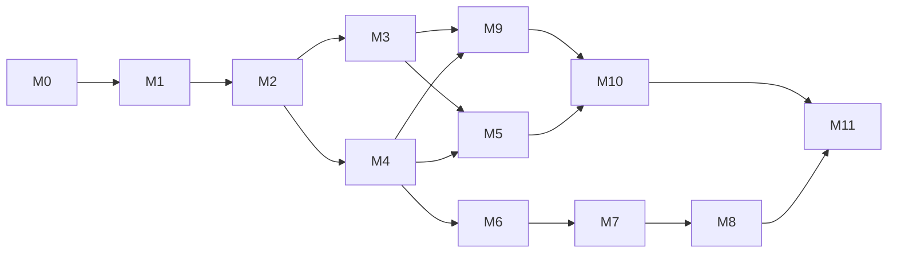

# Fable 5 Implementation Plan: Unified Crossplane Fleet Control Plane

Date: 2026-07-05 (revised 2026-07-10: local-first ordering)
Status: Draft (companion to [fable-5-arch-spec.md](fable-5-arch-spec.md) and [ADR-19](../../adr/0019-fable-5-architecture-plan.md))
Executor: Sonnet 4.6 under human review; one milestone per branch/PR series

## 0. Revision note (2026-07-10)

The roadmap is reordered **local-first**: Rackspace Spot has proven less
reliable than the home lab, so the control plane moves to a new Talos Linux
cluster on home lab KVM infrastructure (superseding the ADR-3 placement), and
the core control plane services (identity, secrets, monitoring) are built on
that foundation before any cloud substrate work. Cloud compositions (EKS, GKE,
AKS, OKE) move to the back half of the roadmap. The `XKubernetesCluster` XRD
is now proven first on the `talos-kvm` composition rather than EKS.

**Bootstrap stance**: the new control plane cluster is a deliberate,
script-bootstrapped pet (OpenTofu + libvirt + talosctl driven from `.bin/`,
fully documented and reproducible). It is NOT self-managed by Crossplane — a
control plane cannot safely provision or upgrade the cluster it runs on.
Every *other* cluster in the fleet is provisioned via `XKubernetesCluster`
claims from this cluster. This mirrors the ADR-3 pattern on the new substrate.

## 1. How to use this plan

Each milestone is sized to be executed by Sonnet 4.6 in a small number of
sessions, with the human reviewing PRs and performing the few steps that
require out-of-band access (hardware, UniFi/TrueNAS admin, cloud accounts,
DNS registrar). Milestones are ordered by dependency; overlap opportunities
are noted in the table.

Timeline assumes a single maintainer at part-time home lab pace (roughly 6-10
focused hours/week) with Sonnet 4.6 doing the authoring. Durations are
calendar estimates, not effort estimates.

### Working agreements for Sonnet 4.6 (read before every milestone)

1. **Repo conventions are law**: application layout per ADR-10 (`applications/<name>/base` + provider variants), every application gets a `catalog.yaml` (ADR-18), Helm charts hardened via Kustomize patches (ADR-13), composition style per ADR-11 (pipeline mode, function-go-templating, EnvironmentConfigs).
2. **Never edit the rendered repo**; author in `flux-platform-src`, let CI render (ADR-8, ADR-9). Run `.bin/render` and the lint suite locally before opening a PR.
3. **Every new namespace ships default-deny NetworkPolicies plus explicit allows** (ADR-17); remember Calico evaluates egress post-DNAT — target pod ports, not service ports (project memory).
4. **Secrets**: SOPS+age for bootstrap-time values only; everything else via external-secrets-operator once OpenBao exists (M3).
5. **Tests**: chainsaw tests under `tests/<component>/` following the step-ca pattern; each milestone's exit criteria include a passing chainsaw suite where marked.
6. **Docs**: each milestone that introduces a decision writes the corresponding ADR (list in spec section 18) and a runbook under `docs/runbooks/` for any new operational procedure.
7. **Memory**: update `docs/memory/` when a non-obvious operational fact is learned; update openbrain (tags: `environment=home-lab`, `project=flux-platform`) for cross-session facts.
8. **Verification is part of done**: kubeconfig paths come from `clusters/<name>/catalog.yaml` annotations; use the step-ca connectivity check from project memory when touching PKI.

## 2. Milestone overview

| # | Milestone | Depends on | Duration | New ADRs |
|---|---|---|---|---|
| M0 | Baseline audit, contract tests, migration inventory | — | 1 wk | — |
| M1 | Home lab substrate + Talos control plane cluster bootstrap | M0 | 4 wk | Control plane on Talos-on-KVM (supersedes ADR-3), UniFi BGP LB, on-prem substrate |
| M2 | Control plane service migration off Rackspace Spot | M1 | 3 wk | (amends migration ADR) |
| M3 | Identity and secrets core: OpenBao, Keycloak, Pinniped, Garage | M2 | 3 wk | OpenBao, Keycloak+Pinniped |
| M4 | XKubernetesCluster XRD + talos-kvm composition; observability cluster via claim | M2 | 3 wk | XKubernetesCluster |
| M5 | Observability backbone: LGTM + OTel pipelines fleet-wide | M3, M4 | 3 wk | LGTM on Garage |
| M6 | AWS EKS composition (first cloud substrate) | M4 | 2 wk | (amends XKubernetesCluster) |
| M7 | GCP + Azure substrates and dual-rail WIF | M6 | 3 wk | Dual-rail WIF |
| M8 | OCI substrate | M7 | 2 wk | (amends XKubernetesCluster) |
| M9 | Multi-tenancy: XTenant, Capsule, Kyverno, Flux lockdown, fleet RBAC | M3, M4 | 3 wk | Multi-tenancy model |
| M10 | Messaging and incident flow: NATS JetStream, CloudEvents, Dispatch | M9, M5 | 2 wk | NATS backbone |
| M11 | Fleet hardening: DR drills, showback, Trivy, runbooks, chaos day | all | 3 wk | — |

Total: roughly 32 calendar weeks (~7-8 months) at part-time pace, with slack.
Compression options: M3 and M4 can run in parallel (different subsystems);
M9 can start any time after M4; M6-M8 are independent of M9/M10 and can be
deferred further without blocking anything local.

**Local-first payoff**: after M5 (roughly the 4-month mark) the entire core
platform — control plane, identity, secrets, monitoring — runs on home lab
hardware with zero dependence on Rackspace Spot and no cloud spend beyond DNS.

## 3. Milestones

### M0 — Baseline audit, contract tests, migration inventory (1 week)

Goal: freeze a known-good baseline of the Spot control plane and inventory
everything that must move, so migration is a checklist rather than an
archaeology dig.

**Detailed design (2026-07-11, approved):**
[2026-07-11-m0-baseline-audit-design.md](2026-07-11-m0-baseline-audit-design.md)
— portable chainsaw suites in `tests/platform-baseline/` (parametrized per
cluster so the same runner becomes the M2 acceptance gate), a read-only
regenerable migration inventory generator, and the cold-start runbook
skeleton. The design doc supersedes the generic task list below where they
differ.

Tasks:
1. Chainsaw suites asserting current invariants: Flux kustomizations healthy;
   step-ca issuing (reuse step-ca connectivity validation from memory); SVID
   trust domain correct (ADR-16); Crossplane providers healthy; default-deny
   present in all platform namespaces. These same suites validate the new
   control plane after migration.
2. Migration inventory doc: every Crossplane managed resource and claim on the
   Spot cluster (with external names and deletion policies), every CNPG
   database, every SOPS secret, every DNS record pointing at Spot
   (`ca.crossplane.rye.ninja` and friends), Flux entry points.
3. `docs/runbooks/control-plane-cold-start.md`: documented order TrueNAS →
   KVM → control plane → step-ca → (placeholders for OpenBao/Keycloak).

Exit criteria: `tests/platform-baseline/` chainsaw suite green against the
live Spot control plane; migration inventory reviewed by human.

Human prerequisites: none.

### M1 — Home lab substrate + Talos control plane cluster (4 weeks)

Goal: a production-quality Talos cluster on KVM with TrueNAS storage and
UniFi BGP load balancing, Flux-synced from the rendered repo — empty of
control plane services but ready to receive them.

**Detailed design (2026-07-11, approved):**
[2026-07-11-m1-controlplane-cluster-design.md](2026-07-11-m1-controlplane-cluster-design.md)
— single KVM host `mf-ms-a2-01`, **IPv6-only** cluster (static ULA for
nodes/etcd/internal VIPs, SLAAC GUA for egress/ingress, Tayga NAT64 + DNS64
appliance for IPv4-only endpoints like GitHub/ghcr), ZFS-mirrored VM storage
with zfs-send DR to TrueNAS, separate rendered repo, new SOPS key scoped to
`clusters/controlplane/`. The design doc supersedes the generic task list
below where they differ.

Tasks:
1. **KVM host preparation** (human + documented): libvirt enabled, storage
   pools defined, bridge/VLAN networking to the reserved platform VLAN;
   host inventory recorded in `providers/kvm/hosts.yaml`.
2. **OpenTofu modules** under `providers/kvm/`: libvirt VM provisioning from
   Talos image factory images (qemu-guest-agent extension), static MACs/IPs,
   per-host anti-affinity for control plane nodes.
3. **Bootstrap scripts** in `.bin/` (pattern of ADR-3/ADR-14):
   `create-controlplane-cluster.sh` drives tofu apply + `talosctl`
   machine config generation, bootstrap, kubeconfig retrieval. Talos machine
   secrets SOPS-encrypted in-repo until OpenBao exists (M3), then migrated.
   Cluster shape: 3 control plane VMs (4 vCPU / 8 GB) + 3 workers
   (4 vCPU / 16 GB).
4. **Cluster entry**: `clusters/controlplane/` with `catalog.yaml`
   (System entity, `rye.ninja/kubeconfig` annotation, rendered-repo
   annotations per ADR-8/ADR-18) so CI discovers it. Trust domain
   `controlplane.rye.ninja` reserved per ADR-16 conventions (delegation claim
   lands in M2 when Crossplane arrives).
5. **Platform baseline** on the new cluster via Flux: Calico with default-deny
   (ADR-17), priority classes, reloader, gateway-api CRDs, Envoy Gateway,
   `applications/democratic-csi/` (new: TrueNAS iSCSI default StorageClass +
   NFS RWX class), Flux monitoring.
6. **UniFi BGP**: Calico BGP peering with the UniFi 10.5 gateway; reserved
   VLAN + per-cluster VIP pool (/27); external-dns UniFi webhook provider for
   LAN records. ADR: UniFi BGP load balancing.
7. Storage smoke tests (PVC bind/expand on iSCSI, RWX on NFS) as chainsaw
   suites; VIP reachability test.
8. ADRs: control plane on Talos-on-KVM (supersedes ADR-3 placement); on-prem
   substrate (Talos, democratic-csi); UniFi BGP.
9. Runbooks: KVM host add/replace; Talos node replace; Talos upgrade;
   TrueNAS maintenance window.

Exit criteria: new cluster reconciles `clusters/controlplane` from the
rendered repo; PVCs bind on TrueNAS iSCSI; a LoadBalancer service gets a
BGP-advertised VIP reachable on the LAN; `talosctl health` clean; cold-start
runbook section for the new cluster written and sanity-checked.

Human prerequisites: KVM host capacity (see resource table), UniFi 10.5 BGP
enablement, VLAN + VIP pool allocation, TrueNAS API key for democratic-csi.

### M2 — Control plane service migration off Spot (3 weeks)

Goal: step-ca, Crossplane, and all fleet-management duties run on
`controlplane`; Rackspace Spot decommissioned. Parallel-run throughout —
Spot stays authoritative until each service's cutover is verified.

Tasks:
1. **CNPG + step-ca**: deploy CNPG operator and `step-ca-db` on the new
   cluster; restore from barman backup; deploy step-ca with root/intermediate
   key material from SOPS (root identity must not change — fleet trust
   depends on it). Verify with the step-ca fingerprint check from memory.
2. **DNS cutover**: repoint `ca.crossplane.rye.ninja` to the new cluster's
   VIP (via UniFi port-forward or existing ingress path). Introduce the
   stable alias `ca.rye.ninja` now and prefer it in all new issuer configs so
   the CA hostname stops encoding its host cluster; keep the old name serving
   through the transition.
3. **cert-manager stack** (cert-manager, approver-policy, trust-manager,
   csi-driver-spiffe) on the new cluster with trust domain
   `controlplane.rye.ninja` (ADR-16: set before first SVID issuance).
4. **Crossplane migration**: install Crossplane + providers + functions +
   compositions on the new cluster via Flux. Migrate managed resource state:
   set `deletionPolicy: Orphan` on all managed resources on Spot, pause Spot
   Crossplane, export claims/XRs/managed resources with external names,
   apply on the new cluster and verify providers observe (not recreate) the
   external resources, then flip deletion policies back. The M0 inventory is
   the checklist; do providers one at a time (kubernetes, aws-iam,
   aws-rolesanywhere, aws-route53, cloudflare, github).
5. **Roles Anywhere re-enrollment**: provider credential stacks (ADR-12) on
   the new cluster get fresh SVIDs under the new trust domain; update trust
   anchors/profiles and ABAC conditions accordingly.
6. **external-dns, external-secrets-operator, flux-monitoring** migrate with
   the same parallel-run pattern.
7. **Spot decommission**: after a full week of clean reconciliation and green
   M0 contract suites against the new cluster — archive `clusters/crossplane/`
   entry, delete the Spot cluster, remove its DNS records, update
   `docs/memory/` (kubeconfig lookup note) and openbrain.
8. ADR: record the executed migration + supersession of ADR-3.

Exit criteria: M0 contract chainsaw suites green against `controlplane`;
all Crossplane managed resources healthy with zero unintended recreations
(audit via external-name diff); step-ca fingerprint unchanged; Spot deleted;
monthly Spot spend at zero.

Human prerequisites: DNS registrar/Cloudflare access for cutover; final
go/no-go on Spot deletion.

### M3 — Identity and secrets core (3 weeks)

Goal: OpenBao, Keycloak, Pinniped Supervisor, and Garage running HA on
`controlplane`; ESO consuming OpenBao; humans SSO into the first OIDC
client. Runs on reliable local infra with real TrueNAS-backed storage.

Tasks:
1. `applications/garage/`: 3-node Garage on the control plane cluster,
   volumes on TrueNAS iSCSI — the fleet S3 endpoint for backups, LGTM chunks
   (M5), and JWKS mirrors (M4). (Spec section 13 places Garage here; the S3
   seam makes later relocation cheap.)
2. `applications/openbao/`: HA raft (3 replicas), TLS from cert-manager,
   static unseal keys SOPS-encrypted, audit log to stdout; raft snapshot
   CronJob to Garage plus one encrypted off-site copy (cloud bucket or
   equivalent, spec risk table).
3. Migrate Talos machine secrets and other M1-era SOPS values that are not
   bootstrap-critical into OpenBao; configure ESO `ClusterSecretStore` using
   OpenBao Kubernetes/JWT auth; migrate one existing secret as proof.
4. `applications/cnpg-clusters/keycloak-db/` + `applications/keycloak/`:
   Keycloak on CNPG, realm `ryezone-labs` bootstrapped declaratively, groups
   per spec section 6.1, exposed at `https://id.rye.ninja` via Envoy Gateway +
   external-dns (UniFi port-forward or Cloudflare Tunnel per spec 13);
   barman backups to Garage.
5. `applications/pinniped-supervisor/`: federate to Keycloak; issuer
   `https://sso.rye.ninja`. Concierge on the control plane cluster; verify
   `pinniped get kubeconfig` yields working group-based RBAC.
6. ADRs: OpenBao secret store; Keycloak + Pinniped identity.
7. Runbooks: OpenBao unseal; OpenBao restore; Keycloak realm restore;
   Pinniped kubeconfig issuance; Garage node replacement.

Exit criteria: chainsaw suites for OpenBao (seal/unseal status, ESO
round-trip) and Pinniped (OIDC login → RBAC-scoped kubectl) green; Garage
serves S3 round-trip; scheduled OpenBao and Keycloak backups verified
restorable once; a human completes `kubectl get pods` authenticated through
Keycloak.

Human prerequisites: approve realm/group names; choose off-site backup
location; confirm public exposure path (port-forward vs Cloudflare Tunnel).

### M4 — XKubernetesCluster XRD + talos-kvm composition (3 weeks)

Goal: `kubectl apply` of one KubernetesCluster claim produces a fully
registered, Flux-synced Talos workload cluster on KVM. The observability
cluster is provisioned this way as the proving ground. This is the
pattern-setting milestone for the whole fleet.

Tasks:
1. `applications/crossplane-providers/provider-terraform/` (OpenTofu runtime)
   reusing the `providers/kvm/` modules from M1; KVM host inventory
   EnvironmentConfig.
2. `applications/crossplane-resources/xkubernetescluster/`: XRD per spec 5.1;
   composition `cluster-talos-kvm` fulfilling the spec 5.2 contract — VM
   provisioning, Talos machine config generation (secrets to OpenBao),
   bootstrap, DNS delegation + trust domain, kubeconfig connection secret,
   provider-kubernetes ProviderConfig, Flux Operator + FluxInstance push,
   `service-account-issuer=https://oidc.<trustDomain>` plus a JWKS mirror
   CronJob publishing discovery docs to Garage behind a public hostname.
3. Workload-cluster baseline layer: `clusters/observability/` aggregating the
   thin baseline (Calico policies, cert-manager+SPIFFE with trust domain
   patch chaining to step-ca, ESO→OpenBao, Pinniped Concierge, democratic-csi,
   priority classes, reloader, flux monitoring).
4. Deletion test on a throwaway claim: teardown garbage-collects VMs, DNS,
   ProviderConfig, OpenBao entries; Usage guards where needed.
5. Backstage System catalog.yaml generation for claimed clusters (ADR-18).
6. ADR: XKubernetesCluster fleet abstraction.

Exit criteria: chainsaw suite provisions and tears down an ephemeral
`KubernetesCluster` claim end-to-end on KVM; the `observability` cluster
claim reconciles; Pinniped login works on it; an ESO secret syncs from
OpenBao; JWKS publicly fetchable at its issuer URL; teardown leaves no
orphans.

Human prerequisites: KVM capacity for the observability cluster (3x 8 GB VMs)
plus ephemeral test VMs.

### M5 — Observability backbone (3 weeks)

Goal: unified fleet telemetry — every cluster ships OTLP to the LGTM stack on
the observability cluster; Grafana single-pane; alerts flow.

Tasks:
1. `applications/lgtm/`: Mimir, Loki, Tempo (simple-scalable, Garage-backed),
   Grafana with Keycloak OIDC on the observability cluster.
2. OTLP gateway ingress with SPIFFE mTLS (Envoy Gateway; client SVID
   verification against the fleet trust bundle) at `otlp.obs.rye.ninja`
   (LAN VIP; public exposure only when cloud clusters arrive in M6).
3. Platform-baseline OTel collectors (agent DaemonSet + gateway Deployment)
   added to the baseline and to `controlplane`; target allocator adopts
   existing ServiceMonitors; resource attributes per spec 9.1.
4. Dashboards: fleet overview (Flux health, apiserver SLIs, cert expiry, CNPG
   lag, node capacity, TrueNAS/democratic-csi volume health, BGP peer state).
5. Grafana Alerting baseline: Flux reconciliation failure, SVID/cert expiry
   window, OpenBao sealed, backup job failures, KVM host down. Notification
   to email/ntfy until Dispatch (M10).
6. ADR: LGTM-on-Garage observability backend.

Exit criteria: metrics/logs/traces from both home lab clusters queryable in
one Grafana; kill a Flux kustomization on either cluster and receive an alert
within 5 minutes.

Human prerequisites: none.

### M6 — AWS EKS composition (2 weeks)

Goal: first cloud substrate through the now-proven XRD contract.

Tasks:
1. `applications/crossplane-providers/provider-aws-eks/` (+ ec2/vpc as
   needed), isolated credential stacks per ADR-12.
2. Composition `cluster-eks` fulfilling the spec 5.2 contract, reusing the
   workload baseline; WIF enrollment via existing Roles Anywhere pattern;
   native EKS OIDC issuer recorded in status.
3. Public exposure of `otlp.obs.rye.ninja`, `sso.rye.ninja`, `ca.rye.ninja`
   for out-of-LAN clusters (per spec 13 ingress paths), with mTLS/OIDC
   enforcement verified.
4. Deletion/GC test; catalog entry; amend XKubernetesCluster ADR.

Exit criteria: one EKS claim end-to-end (Pinniped login, ESO secret, OTLP
shipping, SVID-based AWS access); teardown clean; cost recorded.

Human prerequisites: AWS budget approval (~$75-150/mo while the test cluster
exists).

### M7 — GCP + Azure substrates and dual-rail WIF (3 weeks)

Unchanged in content from the original plan (spike first: validate GCP X.509
WIF against step-ca SVIDs and Azure Entra federated credentials against a
cluster OIDC issuer; then `cluster-gke` and `cluster-aks` compositions with
ADR-12-pattern least privilege; ADR: dual-rail WIF).

Exit criteria: one GKE and one AKS claim reconcile end-to-end; a pod on each
exchanges its SVID/SA token for scoped cloud credentials; no static cloud
keys outside OpenBao break-glass.

Human prerequisites: GCP project + billing, Azure subscription + Entra tenant
(~$100-200/mo combined while test clusters run).

### M8 — OCI substrate (2 weeks)

Unchanged: evaluate `provider-upjet-oci` (2-day timebox) with
provider-terraform fallback inside the same composition contract; OCI OIDC
WIF; free-tier where possible. Exit criteria as M7 for one OKE claim.

Human prerequisites: OCI tenancy + budget guard.

### M9 — Multi-tenancy (3 weeks)

Unchanged in content from the original plan: `XTenant` XRD (Keycloak groups,
namespace sets, Flux tenant Kustomization + serviceAccount, RoleBindings,
observability tenant ID, NATS account placeholder, Backstage System entry);
Flux lockdown flags fleet-wide; Capsule on shared clusters; Kyverno policy
set (generate default-deny, cosign verify, privilege guards); convert
`example-app-spiffe-csi` into tenant `demo`. ADR: multi-tenancy model.

Exit criteria: chainsaw isolation suite (tenant A cannot touch tenant B;
tenant Flux cannot escape its namespaces; tenant-scoped Pinniped login sees
only tenant namespaces).

Can start any time after M4; does not require the cloud milestones.

### M10 — Messaging and incident flow (2 weeks)

Unchanged in content: NATS JetStream core (3 nodes, JetStream on iSCSI) on
`controlplane`; leaf nodes in the workload baseline over SPIFFE mTLS;
accounts wired to XTenant; Flux notification-controller → CloudEvents on
`platform.flux.*`; `applications/dispatch/` (CNPG-backed, Keycloak OIDC) on
the observability cluster; Grafana Alerting → Dispatch. ADR: NATS backbone.

Exit criteria: leaf-node publish replays to core after a simulated network
cut; a forced Flux failure produces a Dispatch incident with the CloudEvent
attached.

### M11 — Fleet hardening and operations (3 weeks)

As the original plan, with the home lab now the primary DR surface:

1. **DR drills** (each a runbook): full home lab cold start (TrueNAS → KVM →
   control plane → step-ca → OpenBao → Keycloak → fleet); OpenBao restore;
   Keycloak restore; Garage node loss; KVM host loss with control plane node
   rebuild; workload-cluster rebuild from claim (target: under 1 hour to
   baseline-healthy).
2. Backup audit: every stateful platform service has scheduled,
   restore-tested, off-site-encrypted backups (Garage + one cloud copy).
3. `applications/trivy-operator/` fleet-wide; findings to Mimir/Grafana.
4. OpenCost per cluster + showback dashboards (ADR-6); budget alerts to
   Dispatch.
5. step-ca intermediate rotation drill (ADR-15), timed.
6. Chaos day: pull power on a KVM host, sever the WAN link (leaf-node replay
   check), revoke a leaf cert — record MTTR, file follow-ups.
7. Documentation sweep: diagram refresh, runbook index, "new cluster in a
   day" onboarding doc, memory/openbrain updates.

Exit criteria: all drills pass with runbooks; no stateful service without a
restore-tested backup; showback covers all substrates in use.

## 4. Resource requirements

### Home lab hardware (needed from M1)

| Component | Minimum | Notes |
|---|---|---|
| KVM hosts | 2 hosts, 64 GB RAM / 16 threads each; 3 preferred (control plane node anti-affinity) | Control plane cluster: 3x (4 vCPU/8 GB) CP + 3x (4 vCPU/16 GB) workers ≈ 72 GB. Observability cluster (M4): 3x 8 GB. Plus ephemeral test VMs |
| TrueNAS Scale | ~2 TB usable SSD/NVMe for iSCSI; HDD pool acceptable for Garage cold data | LGTM retention (30d metrics / 14d logs / 7d traces) ≈ 200-400 GB; CNPG + OpenBao + Keycloak state is small |
| Network | UniFi 10.5 gateway with BGP; reserved VLAN; VIP pool per cluster (/27); inbound 443 (or Cloudflare Tunnel) for `ca/sso/id/oidc` endpoints from M6 | LAN-only until cloud clusters arrive |
| UPS | Graceful shutdown for TrueNAS + KVM hosts | The identity and secrets core lives here from M3 |

### Cloud budgets

| Item | Est. monthly | When |
|---|---|---|
| Rackspace Spot | current spend → **$0 after M2** | decommissioned |
| AWS (existing Route53/IAM + EKS test) | $75-150 during M6+ | test clusters torn down between milestones |
| GCP / Azure | $100-200 combined during M7 | |
| OCI | $0-40 during M8 | free tier where possible |

Note: through M5 the only cloud spend is DNS (Route53/Cloudflare) — the Spot
savings from M2 onward partially fund the later cloud milestones.

### People and agent time

- Human: 6-10 h/week; M1-M2 are the heaviest human-touch milestones
  (hardware, UniFi/TrueNAS admin, DNS cutover, migration go/no-go).
- Sonnet 4.6: authoring within working agreements (section 1); expect 2-5
  sessions per milestone. Any deviation from an ADR requires a PR comment
  flagging it for human decision, not silent divergence.

## 5. Milestone dependency graph

## 6. Definition of done (program level)

1. The control plane and all core services (identity, secrets, monitoring,
   messaging) run on home lab infrastructure with no dependence on any single
   cloud vendor; Rackspace Spot is decommissioned.
2. A `KubernetesCluster` claim provisions a working, registered, Flux-synced,
   observable cluster on any supported substrate with no manual steps beyond
   PR review.
3. No static cloud credentials exist outside OpenBao break-glass paths.
4. One SSO (Keycloak) authenticates humans to every cluster and every
   platform UI; one PKI (step-ca/SPIFFE) authenticates every platform data
   path.
5. One Grafana answers "is the fleet healthy?" and one Dispatch receives
   every platform alert.
6. Every stateful platform service has a restore-tested backup; the home lab
   cold-start runbook has been executed successfully at least once.
7. Every architectural decision in the spec has a merged ADR.
