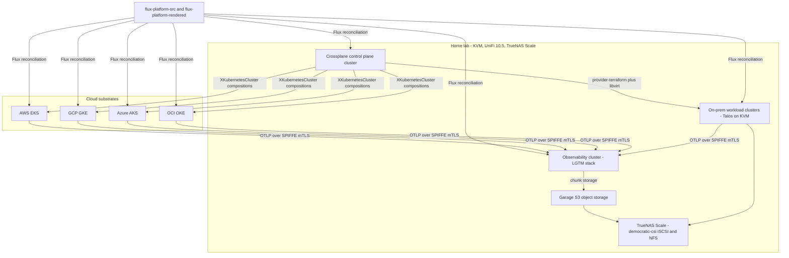

# Fable 5 Architecture Specification: Unified Crossplane Fleet Control Plane

Date: 2026-07-05 (revised 2026-07-10: control plane relocates to home lab Talos-on-KVM, superseding the ADR-3 Rackspace Spot placement; roadmap reordered local-first)
Status: Draft (companion to [ADR-19](../../adr/0019-fable-5-architecture-plan.md))
Author: Claude Fable 5, reviewed by Esten Rye
Implementation plan: [fable-5-arch-plan.md](fable-5-arch-plan.md)

## 1. Purpose

Define the target architecture for a Crossplane-based control plane that manages
the lifecycle (provisioning, configuration, monitoring) of a fleet of Kubernetes
clusters spanning:

- **On-premise home lab**: KVM hypervisors, Ubiquiti Network 10.5, TrueNAS Scale
- **Cloud**: AWS, GCP, OCI, Azure

The spec is written to be executable by Sonnet 4.6 following the milestones in
the companion plan. It builds on, and does not replace, the accepted ADRs in
[docs/adr/](../../adr/); where this spec introduces a new decision, the plan
schedules a new ADR to record it.

## 2. Guiding principles

1. **Vendor agnosticism through protocol seams.** Every integration point uses
   an interoperable protocol so the implementation behind it can be swapped:
   OIDC for authentication, SPIFFE X.509 SVIDs for workload identity, OTLP for
   telemetry, S3 API for object storage, PostgreSQL wire protocol for state,
   CloudEvents for messaging, Gateway API for ingress, CSI for storage.
2. **Self-host core services when it improves agnosticism.** Identity, secrets,
   observability, databases, and messaging are self-hosted in the home lab.
   Cloud services are used only for substrate (compute, managed Kubernetes,
   DNS) where a Crossplane composition isolates the vendor surface.
3. **One claim shape per capability.** Consumers request clusters, databases,
   DNS zones, and IAM through XRD claims; vendor differences live inside
   compositions (ADR-11). No consumer manifest references a cloud provider
   directly.
4. **GitOps is the only write path.** Humans author in `flux-platform-src`,
   CI renders to `flux-platform-rendered`, Flux applies (ADR-8, ADR-9, ADR-10).
   `kubectl apply` is for break-glass only.
5. **Zero long-lived credentials.** All cloud access flows through Workload
   Identity Federation; all intra-fleet mTLS flows through SPIFFE SVIDs; the
   only static secrets are the SOPS-encrypted bootstrap set.
6. **The Backstage catalog is the topology source of truth** (ADR-18). Fleet
   membership, kubeconfig locations, and rendered-repo mappings are declared in
   `catalog.yaml` files, and automation discovers clusters from them.

## 3. Current state (what already exists)

| Capability | Implementation | Reference |
|---|---|---|
| Control plane cluster | Rackspace Spot, Flux Operator, Crossplane — **migrating to Talos-on-KVM in the home lab** (plan M1-M2; Spot has proven less reliable than local infrastructure) | ADR-3 (being superseded) |
| GitOps pipeline | source to rendered repo, CI render + lint, auto-merge | ADR-8, ADR-9 |
| Repo layout | `applications/<name>/base` + provider variants, cluster aggregation | ADR-10 |
| Compositions | pipeline-mode, function-go-templating, EnvironmentConfigs | ADR-11 |
| Workload PKI | step-ca (HA on CNPG), cert-manager, approver-policy, trust-manager, csi-driver-spiffe | ADR-5, ADR-15, ADR-16 |
| AWS WIF | IAM Roles Anywhere with SPIFFE-URI session-tag ABAC, per-provider IAM isolation | ADR-5, ADR-12 |
| Providers installed | AWS (iam, route53, rolesanywhere), Cloudflare (dns, zone), GitHub, Kubernetes | `applications/crossplane-providers/` |
| Networking | Calico default-deny (ADR-17), Envoy Gateway, Gateway API, external-dns | `applications/` |
| Secrets | external-secrets-operator, SOPS+age for bootstrap | ADR-15 |
| Observability seeds | opentelemetry-operator, prometheus-operator CRDs, flux-monitoring | `applications/` |
| Databases | CloudNativePG operator | `applications/cnpg` |
| Incident management | Netflix Dispatch (decision recorded, not yet deployed) | ADR-4 |
| Cost showback | cross-cloud showback approach | ADR-6 |

The architecture below extends this foundation to the full fleet; it does not
rebuild it.

## 4. Target topology



Three cluster roles:

- **Control plane cluster** (`controlplane`, trust domain
  `controlplane.rye.ninja`, Talos on KVM in the home lab, **IPv6-only** with
  ULA internal addressing and a NAT64/DNS64 appliance for IPv4-only
  endpoints — see the
  [M1 design](2026-07-11-m1-controlplane-cluster-design.md)):
  Crossplane, Flux, step-ca, Keycloak, Pinniped Supervisor, OpenBao,
  Garage, NATS core, Backstage. The only cluster with cloud-mutation
  credentials. It is a deliberate, script-bootstrapped pet (OpenTofu +
  libvirt + talosctl from `.bin/`, fully reproducible) and is NOT self-managed
  by Crossplane — a control plane cannot safely provision or upgrade the
  cluster it runs on. It replaces the Rackspace Spot cluster (ADR-3) via the
  parallel-run migration in plan M2.
- **Observability cluster** (new, on-prem): LGTM stack, Garage gateway,
  Dispatch. Isolated so control plane failures and observability failures are
  not correlated.
- **Workload clusters** (fleet): run tenant applications plus a thin platform
  baseline (Flux, cert-manager+SPIFFE, Calico, OTel collectors, Pinniped
  Concierge, ESO, NATS leaf node). Workload clusters never run Crossplane
  (ADR-14).

## 5. Cluster lifecycle: the XKubernetesCluster abstraction

### 5.1 XRD

A single composite resource definition, `XKubernetesCluster` (claim kind
`KubernetesCluster`), is the unit of fleet membership. Spec fields:

```yaml
apiVersion: platform.rye.ninja/v1alpha1
kind: KubernetesCluster
metadata:
  name: workload-aws-use1
spec:
  substrate: eks            # eks | gke | aks | oke | talos-kvm
  region: us-east-1         # provider region or kvm host group
  version: "1.33"
  nodePools:
    - name: default
      size: small           # t-shirt sizes mapped per substrate in EnvironmentConfig
      count: 3
  subdomain: use1           # drives DNS delegation and SPIFFE trust domain (ADR-16)
  tenancy: dedicated        # dedicated | shared (shared installs Capsule)
  compositionRef:
    name: cluster-eks       # selected by substrate label in practice
```

### 5.2 Composition responsibilities (identical contract per substrate)

Every composition, regardless of substrate, must produce:

1. **The cluster** (EKS/GKE/AKS/OKE managed control plane, or Talos VMs on KVM).
2. **DNS delegation**: an `XDelegatedHostedZoneAWS` (or successor multi-provider
   XRD) for `<subdomain>.rye.ninja`, which also fixes the SPIFFE trust domain
   per ADR-16.
3. **Connection secret**: kubeconfig written to the control plane, path
   recorded in the cluster `catalog.yaml` annotation `rye.ninja/kubeconfig`.
4. **Registration**: a `provider-kubernetes` `ProviderConfig` scoped to the new
   cluster so the control plane can push bootstrap resources.
5. **Flux bootstrap**: Flux Operator + `FluxInstance` pointed at
   `clusters/<name>` in the rendered repo (ADR-14 phase structure, now executed
   by the composition via provider-kubernetes instead of `.bin/` scripts).
6. **WIF enrollment**: the substrate-appropriate federation resources
   (section 7) so the cluster's workloads can reach their cloud APIs without
   static keys.
7. **Status surface**: `status.trustDomain`, `status.oidcIssuer`,
   `status.kubeconfigSecretRef`, `status.phase` for consumption by other
   compositions and by Backstage.

### 5.3 Substrate compositions

| Substrate | Provider stack | Notes and trade-offs |
|---|---|---|
| `eks` | upbound `provider-aws-eks` (family already installed) | First cloud target; IAM/Route53 stack already proven |
| `gke` | upbound `provider-gcp-container` + `provider-gcp-iam` | Requires new GCP project bootstrap (M5) |
| `aks` | upbound `provider-azure-containerservice` + `provider-azure-managedidentity` | Entra tenant bootstrap; AKS OIDC issuer enabled at create time |
| `oke` | `provider-upjet-oci` (crossplane-contrib) | Least mature provider; fallback path is `provider-terraform` with the OCI Terraform provider inside the same composition contract, so the claim shape does not change |
| `talos-kvm` | `provider-terraform` (OpenTofu) driving the `dmacvicar/libvirt` provider + Talos image factory | Talos chosen for immutable, API-only nodes (no SSH), consistent with GitOps; `talosctl` already anticipated by ADR-14. Machine configs are generated in the composition, secrets held in OpenBao. This is the **first** composition built (plan M4) — it proves the XRD contract before any cloud substrate. The control plane cluster itself is the exception: script-bootstrapped, not claim-managed (section 4) |

**Trade-off, on-prem provisioning**: Cluster API (CAPI) was considered and
rejected for now — there is no mature CAPI libvirt provider, and running CAPI
alongside Crossplane duplicates the reconciliation model. `provider-terraform`
keeps on-prem clusters inside the same XRD contract. If a first-class Talos or
libvirt Crossplane provider matures, swap happens inside the composition.

### 5.4 Day-2 lifecycle

- **Upgrades**: bump `spec.version` on the claim; compositions map to managed
  upgrade APIs (cloud) or a Talos image + `talosctl upgrade-k8s` sequence via
  provider-terraform.
- **Node pool scaling**: `spec.nodePools[].count` edits; t-shirt sizes are
  resolved per-substrate through an `EnvironmentConfig` so cost-equivalent
  shapes are used in each cloud.
- **Deprovisioning**: claim deletion; compositions must set deletion policies
  so DNS delegations, WIF registrations, and ProviderConfigs are garbage
  collected, and Usages prevent deleting a cluster that still has registered
  tenants in the catalog.

## 6. Human identity and access

### 6.1 Decision

- **Keycloak** (self-hosted on the control plane cluster, backed by CNPG) is
  the fleet OIDC identity provider for humans. Realm `ryezone-labs`, groups
  model platform roles (`platform-admin`, `tenant-<name>-admin`,
  `tenant-<name>-dev`, `viewer`).
- **Pinniped** provides uniform Kubernetes authentication: Supervisor on the
  control plane federates to Keycloak; Concierge on every workload cluster
  exchanges Supervisor-issued tokens for cluster credentials. `kubectl` login
  is identical on every cluster (`pinniped get kubeconfig`), regardless of
  vendor.

### 6.2 Trade-offs

| Option | Verdict |
|---|---|
| Keycloak | **Chosen.** Most mature self-hosted IdP; standard OIDC/OAuth2/SAML; CNPG-friendly. Heavier than alternatives but the protocol seam (OIDC) makes it swappable |
| Zitadel / Authentik | Lighter, but smaller ecosystems; revisit if Keycloak operational cost becomes a problem — swap is config-only for every OIDC client |
| Cloud IdPs (Entra, Google) | Rejected: direct lock-in of the most central control surface |
| Per-cloud apiserver OIDC flags | Rejected as the primary path: AKS and GKE restrict or complicate custom OIDC on the apiserver. Pinniped Concierge works identically everywhere, which is the point. On Talos clusters, structured authentication config MAY additionally trust the Supervisor directly as a defense-in-depth simplification |

### 6.3 RBAC model

- ClusterRoles are defined once in `applications/rbac/` and shipped to every
  cluster via the rendered repo.
- Bindings reference Keycloak groups (asserted by Pinniped). Tenant groups map
  to namespace-scoped RoleBindings generated by the tenancy machinery
  (section 10).
- Keycloak is also the OIDC IdP for Grafana, Backstage, Dispatch, OpenBao
  (human path), and NATS dashboards — one SSO everywhere.

## 7. Workload identity: SPIFFE and dual-rail WIF

### 7.1 Identity fabric

The existing step-ca + cert-manager + csi-driver-spiffe stack (ADR-5, ADR-15,
ADR-16) is the fleet-wide identity fabric:

- Every cluster has a unique trust domain `<subdomain>.rye.ninja` (ADR-16),
  set by its `XKubernetesCluster` composition.
- step-ca on the control plane is the root; each cluster's cert-manager issuer
  chains to it. trust-manager distributes the trust bundle so any workload can
  verify any other workload's SVID — fleet-wide mTLS without a service mesh.
- SPIFFE ID convention: `spiffe://<trustDomain>/ns/<namespace>/sa/<serviceaccount>`.

### 7.2 Dual-rail federation to clouds

| Rail | Mechanism | Clouds | Notes |
|---|---|---|---|
| X.509 SVID | Certificate presented to cloud STS | **AWS** IAM Roles Anywhere (exists, ADR-5/12), **GCP** X.509 workload identity federation | Reuses SVIDs directly; AWS session-tag ABAC pattern (`aws:PrincipalTag/x509SAN/URI`) is replicated as attribute conditions in GCP |
| OIDC JWT | Projected ServiceAccount token federated to cloud STS | **Azure** Entra Workload ID (federated identity credentials), **OCI** OIDC identity propagation, **GCP** (alternative) | Requires each cluster's SA issuer to be publicly resolvable |

**Issuer publication**: EKS/GKE/AKS expose public OIDC issuers natively; the
composition reads them into `status.oidcIssuer`. For `talos-kvm` clusters, the
apiserver is configured with `service-account-issuer=https://oidc.<trustDomain>`
and a CI job (or small controller) mirrors `/.well-known/openid-configuration`
and the JWKS to a public S3-compatible bucket behind that hostname. Mirroring
is preferred over exposing the apiserver: static, cacheable, no new attack
surface. Key rotation must trigger a re-mirror before old keys are dropped.

**Least privilege**: the per-provider credential isolation pattern of ADR-12
(dedicated ServiceAccount + dedicated role + dedicated ProviderConfig, ABAC
pinned to one SPIFFE URI) is replicated for GCP, Azure, and OCI provider
stacks. Break-glass static credentials exist only inside OpenBao with TTL and
audit logging.

### 7.3 Secure control-plane-to-cluster communication

- Control plane reaches workload clusters via their public apiserver endpoints
  using short-lived credentials from the composition-managed kubeconfigs;
  provider-kubernetes ProviderConfigs are the only holders.
- All platform-to-platform data paths (OTLP, NATS leaf connections, OpenBao
  access, Dispatch webhooks) use SPIFFE mTLS with trust bundles distributed by
  trust-manager. Calico default-deny (ADR-17) plus explicit egress policies
  constrain every flow; note the post-DNAT targetPort rule from project memory.

## 8. Secrets

- **OpenBao** (HA raft, 3 replicas) on the control plane cluster is the fleet
  secret store. Chosen over HashiCorp Vault (BUSL license) and cloud secret
  managers (lock-in); the API is Vault-compatible so ESO integration is
  standard.
- **external-secrets-operator** (already deployed) gets a `ClusterSecretStore`
  per cluster targeting OpenBao. Cluster auth uses OpenBao's JWT auth method
  against each cluster's OIDC issuer, bound to namespace/serviceaccount claims —
  the same OIDC rail as cloud WIF, no static tokens.
- **SOPS+age** remains for the bootstrap set only: OpenBao unseal key shares,
  Flux deploy keys, step-ca root material (ADR-15). Unseal is static-key from
  SOPS rather than cloud KMS auto-unseal, trading convenience for vendor
  agnosticism; document the manual unseal runbook.
- OpenBao PKI secrets engine is explicitly NOT used: step-ca remains the one
  CA (ADR-5); OpenBao stores secrets, it does not issue identity.

## 9. Observability

### 9.1 Pipeline (OTLP is the seam)

- Every cluster runs the OpenTelemetry Operator with two collector tiers:
  a DaemonSet **agent** (host metrics, kubelet stats, log tailing, receiver
  for app OTLP) and a Deployment **gateway** (batching, tenant/cluster
  attribute stamping, egress).
- Gateways export OTLP/gRPC over SPIFFE mTLS to the observability cluster.
  `resource` attributes carry `cluster`, `substrate`, `tenant`, and
  `trust_domain` for fleet-wide slicing.
- Prometheus-operator CRDs stay: the target-allocator scrapes existing
  ServiceMonitors/PodMonitors, so current dashboards keep working.

### 9.2 Backend

- **LGTM stack** on the observability cluster: **Mimir** (metrics), **Loki**
  (logs), **Tempo** (traces), **Grafana** (query/dashboards/alerting), all in
  monolithic or simple-scalable mode sized for home lab, chunks on **Garage**
  S3 storage.
- Trade-off: VictoriaMetrics/VictoriaLogs are lighter, but LGTM gives native
  OTLP ingest, one coherent query story, and per-tenant isolation via
  `X-Scope-OrgID` (tenant IDs match platform tenants). Because ingestion is
  OTLP, swapping backends later touches only the gateway exporter config.
- **Alerting**: Grafana Alerting evaluates fleet SLOs (Flux reconciliation
  health from flux-monitoring, apiserver availability, cert expiry from
  approver-policy metrics, CNPG replication lag, NATS consumer lag) and routes
  to **Dispatch** (ADR-4) for incident management, with ntfy/email as the
  notification fallback.
- **Cost**: OpenCost per cluster exports to Mimir; showback dashboards per
  ADR-6.

## 10. Multi-tenancy and RBAC

A **tenant** is: a Backstage `System` entity + a Keycloak group pair
(`-admin`, `-dev`) + a Flux tenant Kustomization + a namespace set + a NATS
account + an observability tenant ID. One `XTenant` XRD on the control plane
materializes all of these from a single claim, so tenancy is a one-manifest
operation.

Enforcement layers on shared clusters:

1. **Flux multi-tenancy lockdown**: kustomize/helm controllers run with
   `--no-cross-namespace-refs=true` and `--default-service-account`; each
   tenant Kustomization sets `spec.serviceAccountName` so tenants can only
   mutate their own namespaces.
2. **Capsule**: tenant namespace self-service with quota, LimitRange, allowed
   StorageClass/IngressClass, and node-pool affinity guardrails. Chosen over
   vCluster (per-tenant control planes are overkill at home lab scale) and
   bare namespaces (no self-service).
3. **Kyverno**: admission policies — generate default-deny NetworkPolicies in
   every new namespace (ADR-17), require SPIFFE CSI volumes for platform-API
   clients, verify cosign signatures on platform images, block hostPath/
   privileged pods outside platform namespaces.
4. **RBAC**: generated RoleBindings map Keycloak tenant groups to namespaces
   (section 6.3).

Dedicated-tenancy clusters skip Capsule but keep Flux lockdown, Kyverno, and
RBAC layers.

## 11. Messaging

- **NATS JetStream**: 3-node core cluster on the control plane cluster;
  every workload cluster runs a **leaf node**, so local publishes tolerate WAN
  partitions and replay when connectivity returns.
- Multi-tenancy via NATS **accounts** (one per tenant plus `platform`);
  decentralized JWT auth (operator/account/user model) with credentials
  distributed through OpenBao/ESO.
- All platform events (cluster lifecycle transitions, Flux notification
  events, Dispatch escalations, showback rollups) are **CloudEvents** over
  NATS subjects `platform.<domain>.<event>` — the envelope keeps NATS
  swappable for Kafka/RabbitMQ.
- Trade-off: Kafka rejected (JVM + broker ops weight unjustified at this
  scale); RabbitMQ rejected (weaker multi-tenancy and WAN edge story). NATS is
  one small binary per node, ideal for the KVM substrate.

## 12. Databases

- **CloudNativePG everywhere** (operator already on the control plane; added
  to the platform baseline for clusters that need local Postgres).
- An `XPostgresDatabase` XRD provides DBaaS: claim yields a CNPG cluster (or a
  database in a shared instance for small tenants), credentials in OpenBao,
  and barman-cloud backups to Garage with retention policy.
- Platform consumers: Keycloak, Dispatch, Backstage, step-ca (exists,
  ADR step-ca-cnpg-ha design). PostgreSQL wire protocol is the seam; a future
  managed offering could back the same claim.

## 13. On-prem substrate details

- **Compute**: Talos Linux VMs on KVM hosts, provisioned by the `talos-kvm`
  composition (section 5.3). KVM host inventory lives in an EnvironmentConfig;
  images come from the Talos image factory with the qemu-guest-agent extension.
- **Block/file storage**: democratic-csi exposes TrueNAS Scale iSCSI
  (StorageClass `truenas-iscsi`, default) and NFS (`truenas-nfs`, RWX) to all
  on-prem clusters.
- **Object storage**: **Garage** cluster (3+ nodes on the control plane
  cluster, volumes on TrueNAS iSCSI) provides S3 API for LGTM chunks, CNPG
  barman backups, JWKS mirrors, and rendered artifacts. It lives on the
  control plane cluster (rather than the observability cluster) because
  backups need it before the observability cluster exists in the local-first
  ordering; the S3 API seam makes relocation cheap if the coupling ever
  hurts. Chosen over MinIO (2025 license/feature-stripping direction) and
  Ceph RGW (operational weight); any S3-compatible store can replace it.
- **Network**: Calico BGP peers with the UniFi 10.5 gateway to advertise
  LoadBalancer VIP pools per cluster (per-cluster /27 from a reserved VLAN).
  Public DNS remains Route53/Cloudflare via external-dns; internal LAN records
  via the external-dns UniFi webhook provider. Remember the Calico post-DNAT
  egress rule (project memory: use pod targetPort, not service port).
- **Ingress for home lab-hosted public endpoints** (Keycloak, Pinniped
  Supervisor, OpenBao, NATS, OTLP gateway, ca.crossplane.rye.ninja): UniFi
  port-forward to Envoy Gateway VIPs with cert-manager TLS; all of these
  endpoints require mTLS or OIDC, and default-deny plus Envoy authorization
  policies constrain exposure. A Cloudflare Tunnel fallback is documented for
  ISPs that block inbound 443.

## 14. Security posture summary

- Identity: SPIFFE SVIDs (machine), OIDC via Keycloak/Pinniped (human), WIF
  (cloud), zero static cloud keys (ADR-12 pattern fleet-wide).
- Admission: Kyverno policies + cosign image verification for platform images.
- Network: Calico default-deny everywhere (ADR-17); explicit egress; SPIFFE
  mTLS on every platform data path.
- Supply chain: source-to-rendered CI (ADR-9) runs kube-linter, checkov,
  kubeconform; images built in `images/docker` are signed with cosign keys
  held in OpenBao.
- Runtime: Trivy Operator for in-cluster vuln/config scanning (phase 2);
  Falco deferred (section 16).
- Rotation: per ADR-15; step-ca intermediate rotation drills scheduled
  quarterly; OpenBao root token revoked after bootstrap, recovery via SOPS
  shares.

## 15. Trade-off register (swap seams)

| Concern | Chosen | Rejected | Seam that enables swap |
|---|---|---|---|
| Human IdP | Keycloak | Zitadel, Authentik, cloud IdPs | OIDC |
| K8s auth | Pinniped | per-cloud apiserver OIDC | OIDC + kubeconfig exec plugin |
| Workload identity | SPIFFE via cert-manager/step-ca | SPIRE server/agent | SPIFFE SVID format (SPIRE remains a possible upgrade with same IDs) |
| Secrets | OpenBao | Vault (BUSL), cloud secret managers | Vault-compatible API via ESO |
| Metrics/logs/traces | LGTM stack | VictoriaMetrics stack, cloud O11y | OTLP |
| Messaging | NATS JetStream | Kafka, RabbitMQ | CloudEvents envelope |
| Object storage | Garage | MinIO, Ceph RGW, cloud S3 | S3 API |
| Database | CNPG Postgres | cloud managed Postgres | PostgreSQL protocol + XRD claim |
| On-prem OS | Talos | Ubuntu+kubeadm, k3s | XKubernetesCluster claim |
| On-prem IaC | provider-terraform + libvirt | Cluster API | Composition internals |
| Tenancy | Capsule + Kyverno | vCluster, HNC | XTenant claim |
| Ingress | Envoy Gateway | ingress-nginx, cloud LBs | Gateway API |

## 16. Non-goals and deferred items

- **Service mesh** (Istio/Linkerd/Cilium mesh): deferred; SPIFFE mTLS +
  NetworkPolicy covers current needs. Revisit if L7 authz between tenant
  services is required.
- **Falco/runtime detection**: deferred to post-M9 hardening.
- **Cross-cluster workload scheduling** (Karmada, multicluster services):
  out of scope; the fleet is lifecycle-unified, not workload-unified.
- **Windows nodes, GPU pools, edge/IoT substrates**: out of scope.
- **Velero fleet backup**: CNPG barman + GitOps re-hydration is the DR story;
  PV backup for stateful non-Postgres workloads is a later ADR.

## 17. Risks

| Risk | Mitigation |
|---|---|
| OCI Crossplane provider immaturity | provider-terraform fallback inside same composition contract (5.3) |
| GCP X.509 WIF constraints don't fit SVID profile | OIDC rail works for GCP too; validate in M5 spike before committing |
| Home lab as single point of failure for the control plane, identity, and secrets | This is a deliberate trade (local infra has proven more reliable than Rackspace Spot): UPS-backed hosts, control plane node anti-affinity across KVM hosts, OpenBao raft snapshots + Keycloak CNPG backups to Garage AND one encrypted cloud bucket (restore drill in the hardening milestone); documented cold-start order: TrueNAS, KVM, control plane, step-ca, OpenBao, Keycloak. Managed clusters keep reconciling and serving while the control plane is down — only lifecycle changes queue |
| IPv6-only control plane: GitHub/ghcr publish no AAAA records; ISP prefix delegation can renumber | Tayga NAT64 + DNS64 appliance for IPv4-only egress (its outage breaks only v4-only pulls, not running workloads); node identity/etcd/internal VIPs on stable ULA; all GUA values derive from one prefix variable with a renumber runbook; see the [M1 design](2026-07-11-m1-controlplane-cluster-design.md) |
| Control plane migration off Spot corrupts fleet state | Parallel-run migration (plan M2): deletionPolicy Orphan + pause + export/import by external name, one provider at a time, against the M0 inventory; step-ca root key material preserved from SOPS so fleet trust never changes; Spot deleted only after a week of clean contract-suite runs |
| JWKS mirror staleness breaks OIDC-rail WIF | Mirror job alerts on drift; overlap window on SA signing key rotation |
| Cost creep across 4 clouds | t-shirt sizing via EnvironmentConfig, OpenCost showback, budget alerts routed to Dispatch |
| Single maintainer bandwidth | Roadmap is strictly incremental; every milestone leaves the platform working; Sonnet 4.6 executes within guardrails (plan doc, section on working agreements) |

## 18. New ADRs this spec implies

The plan schedules these as deliverables: fleet cluster XRD (XKubernetesCluster),
human identity (Keycloak + Pinniped), OpenBao secret store, dual-rail WIF for
GCP/Azure/OCI, observability backend (LGTM on Garage), NATS messaging backbone,
multi-tenancy model (XTenant, Capsule, Kyverno), on-prem substrate (Talos on
KVM, democratic-csi, Garage), and Ubiquiti BGP load-balancer integration.
